<div align="center">


#### UNIVERSIDAD PERUANA DE CIENCIAS APLICADAS

## FACULTAD DE INGENIERÍA

### Carrera de Ingeniería de Software

### Desarrollo de Aplicaciones Open Source

**Ciclo:** 2026-20

**Código del curso:** 1ASI0729

**NRC:** 7753

**Docente del curso:** Bautista Ubillús, Efraín Ricardo

---

## INFORME DE TRABAJO FINAL

**Nombre de la Startup:** Horizon

**Nombre del producto:** EcoTrack

### Integrantes

- Lacuta Lima, Alex Rodrigo - U20241G396
- Espinoza Flores, Aaron André - U202222859
- Payesa Torres, Harrison Hubert - U202221024
- Tello Murga, Javier Oswaldo - U202218387
- Torres Diaz, Rolando Andre - U202323369

### Fecha

Septiembre, 2026

</div>

---

# Registro de Versiones del Informe

| Versión | Fecha | Autor | Descripción de modificación |
|---|---|---|---|
| 0.1 | 10/09/2026 | Tello Murga, Javier Oswaldo | Se creó la estructura base del informe. |

---

# Project Report Collaboration Insights

## Repositories

| URL de la organización del proyecto | URL del repositorio del report |
|---|---|
| [https://github.com/Horizon-OpenSource](https://github.com/Horizon-OpenSource) | [https://github.com/Horizon-OpenSource/report](https://github.com/Horizon-OpenSource/report) |

| URL del repositorio del Landing Page | URL del repositorio del Frontend |
|---|---|
| Pendiente de creación | Pendiente de creación |

| URL del repositorio del Backend |
|---|
| Pendiente de creación |

---

## AV1

Durante el desarrollo del AV1, los integrantes del equipo realizaron sus aportes al Project Report mediante GitHub, utilizando ramas `feature/*`, GitFlow y Conventional Commits para mantener un flujo de trabajo organizado y colaborativo.

### Collaboration Insights


---

## TB1

Durante el desarrollo del TB1, el equipo continuará trabajando colaborativamente sobre el Project Report, incorporando las mejoras y nuevos artefactos correspondientes a la entrega.

### Collaboration Insights


---

## AV2

Durante el desarrollo del AV2, los integrantes continuarán registrando sus contribuciones al informe y los avances correspondientes al proyecto mediante el repositorio de GitHub.

### Collaboration Insights


---

## TB2

Durante el desarrollo del TB2, se registrará la participación final de los integrantes en la elaboración y actualización del Project Report, evidenciando la colaboración realizada durante la etapa final del proyecto.

### Collaboration Insights


---

# Contenido

1. [Student Outcome](#student-outcome)

2. [Capítulo I: Introducción](#capítulo-i-introducción)
    - [1.1. Startup Profile](#11-startup-profile)
        - [1.1.1. Descripción de la Startup](#111-descripción-de-la-startup)
        - [1.1.2. Perfiles de integrantes del equipo](#112-perfiles-de-integrantes-del-equipo)
    - [1.2. Solution Profile](#12-solution-profile)
        - [1.2.1. Antecedentes y problemática](#121-antecedentes-y-problemática)
        - [1.2.2. Lean UX Process](#122-lean-ux-process)
            - [1.2.2.1. Lean UX Problem Statements](#1221-lean-ux-problem-statements)
            - [1.2.2.2. Lean UX Assumptions](#1222-lean-ux-assumptions)
            - [1.2.2.3. Lean UX Hypothesis Statements](#1223-lean-ux-hypothesis-statements)
            - [1.2.2.4. Lean UX Canvas](#1224-lean-ux-canvas)
    - [1.3. Segmentos objetivo](#13-segmentos-objetivo)

3. [Capítulo II: Requirements Elicitation & Analysis](#capítulo-ii-requirements-elicitation--analysis)
    - [2.1. Competidores](#21-competidores)
        - [2.1.1. Análisis competitivo](#211-análisis-competitivo)
        - [2.1.2. Estrategias y tácticas frente a competidores](#212-estrategias-y-tácticas-frente-a-competidores)
    - [2.2. Entrevistas](#22-entrevistas)
        - [2.2.1. Diseño de entrevistas](#221-diseño-de-entrevistas)
        - [2.2.2. Registro de entrevistas](#222-registro-de-entrevistas)
        - [2.2.3. Análisis de entrevistas](#223-análisis-de-entrevistas)
    - [2.3. Needfinding](#23-needfinding)
        - [2.3.1. User Personas](#231-user-personas)
        - [2.3.2. User Task Matrix](#232-user-task-matrix)
        - [2.3.3. User Journey Mapping](#233-user-journey-mapping)
        - [2.3.4. Empathy Mapping](#234-empathy-mapping)
    - [2.4. Big Picture Event Storming](#24-big-picture-event-storming)
    - [2.5. Ubiquitous Language](#25-ubiquitous-language)

4. [Capítulo III: Requirements Specification](#capítulo-iii-requirements-specification)
    - [3.1. User Stories](#31-user-stories)
    - [3.2. Impact Mapping](#32-impact-mapping)
    - [3.3. Product Backlog](#33-product-backlog)

5. [Capítulo IV: Product Design](#capítulo-iv-product-design)
    - [4.1. Style Guidelines](#41-style-guidelines)
        - [4.1.1. General Style Guidelines](#411-general-style-guidelines)
        - [4.1.2. Web Style Guidelines](#412-web-style-guidelines)
    - [4.2. Information Architecture](#42-information-architecture)
        - [4.2.1. Organization Systems](#421-organization-systems)
        - [4.2.2. Labeling Systems](#422-labeling-systems)
        - [4.2.3. SEO Tags and Meta Tags](#423-seo-tags-and-meta-tags)
        - [4.2.4. Searching Systems](#424-searching-systems)
        - [4.2.5. Navigation Systems](#425-navigation-systems)
    - [4.3. Landing Page UI Design](#43-landing-page-ui-design)
        - [4.3.1. Landing Page Wireframe](#431-landing-page-wireframe)
        - [4.3.2. Landing Page Mock-up](#432-landing-page-mock-up)
    - [4.4. Web Applications UX/UI Design](#44-web-applications-uxui-design)
        - [4.4.1. Web Applications Wireframes](#441-web-applications-wireframes)
        - [4.4.2. Web Applications Wireflow Diagrams](#442-web-applications-wireflow-diagrams)
        - [4.4.3. Web Applications Mock-ups](#443-web-applications-mock-ups)
        - [4.4.4. Web Applications User Flow Diagrams](#444-web-applications-user-flow-diagrams)
    - [4.5. Web Applications Prototyping](#45-web-applications-prototyping)
    - [4.6. Domain-Driven Software Architecture](#46-domain-driven-software-architecture)
        - [4.6.1. Design-Level Event Storming](#461-design-level-event-storming)
        - [4.6.2. Software Architecture Context Diagram](#462-software-architecture-context-diagram)
        - [4.6.3. Software Architecture Container Diagrams](#463-software-architecture-container-diagrams)
        - [4.6.4. Software Architecture Components Diagrams](#464-software-architecture-components-diagrams)
    - [4.7. Software Object-Oriented Design](#47-software-object-oriented-design)
        - [4.7.1. Class Diagrams](#471-class-diagrams)
    - [4.8. Database Design](#48-database-design)
        - [4.8.1. Database Diagrams](#481-database-diagrams)

6. [Capítulo V: Product Implementation, Validation & Deployment](#capítulo-v-product-implementation-validation--deployment)
    - [5.1. Software Configuration Management](#51-software-configuration-management)
        - [5.1.1. Software Development Environment Configuration](#511-software-development-environment-configuration)
        - [5.1.2. Source Code Management](#512-source-code-management)
        - [5.1.3. Source Code Style Guide & Conventions](#513-source-code-style-guide--conventions)
        - [5.1.4. Software Deployment Configuration](#514-software-deployment-configuration)
    - [5.2. Landing Page, Services & Applications Implementation](#52-landing-page-services--applications-implementation)
        - [5.2.1. Sprint 1](#521-sprint-1)
            - [5.2.1.1. Sprint Planning 1](#5211-sprint-planning-1)
            - [5.2.1.2. Aspect Leaders and Collaborators](#5212-aspect-leaders-and-collaborators)
            - [5.2.1.3. Sprint Backlog 1](#5213-sprint-backlog-1)
            - [5.2.1.4. Development Evidence for Sprint Review](#5214-development-evidence-for-sprint-review)
            - [5.2.1.5. Execution Evidence for Sprint Review](#5215-execution-evidence-for-sprint-review)
            - [5.2.1.6. Services Documentation Evidence for Sprint Review](#5216-services-documentation-evidence-for-sprint-review)
            - [5.2.1.7. Software Deployment Evidence for Sprint Review](#5217-software-deployment-evidence-for-sprint-review)
            - [5.2.1.8. Team Collaboration Insights during Sprint](#5218-team-collaboration-insights-during-sprint)
        - [5.2.2. Sprint 2](#522-sprint-2)
            - [5.2.2.1. Sprint Planning 2](#5221-sprint-planning-2)
            - [5.2.2.2. Aspect Leaders and Collaborators](#5222-aspect-leaders-and-collaborators)
            - [5.2.2.3. Sprint Backlog 2](#5223-sprint-backlog-2)
            - [5.2.2.4. Development Evidence for Sprint Review](#5224-development-evidence-for-sprint-review)
            - [5.2.2.5. Execution Evidence for Sprint Review](#5225-execution-evidence-for-sprint-review)
            - [5.2.2.6. Services Documentation Evidence for Sprint Review](#5226-services-documentation-evidence-for-sprint-review)
            - [5.2.2.7. Software Deployment Evidence for Sprint Review](#5227-software-deployment-evidence-for-sprint-review)
            - [5.2.2.8. Team Collaboration Insights during Sprint](#5228-team-collaboration-insights-during-sprint)
        - [5.2.3. Sprint 3](#523-sprint-3)
            - [5.2.3.1. Sprint Planning 3](#5231-sprint-planning-3)
            - [5.2.3.2. Aspect Leaders and Collaborators](#5232-aspect-leaders-and-collaborators)
            - [5.2.3.3. Sprint Backlog 3](#5233-sprint-backlog-3)
            - [5.2.3.4. Development Evidence for Sprint Review](#5234-development-evidence-for-sprint-review)
            - [5.2.3.5. Execution Evidence for Sprint Review](#5235-execution-evidence-for-sprint-review)
            - [5.2.3.6. Services Documentation Evidence for Sprint Review](#5236-services-documentation-evidence-for-sprint-review)
            - [5.2.3.7. Software Deployment Evidence for Sprint Review](#5237-software-deployment-evidence-for-sprint-review)
            - [5.2.3.8. Team Collaboration Insights during Sprint](#5238-team-collaboration-insights-during-sprint)
        - [5.2.4. Sprint 4](#524-sprint-4)
            - [5.2.4.1. Sprint Planning 4](#5241-sprint-planning-4)
            - [5.2.4.2. Aspect Leaders and Collaborators](#5242-aspect-leaders-and-collaborators)
            - [5.2.4.3. Sprint Backlog 4](#5243-sprint-backlog-4)
            - [5.2.4.4. Development Evidence for Sprint Review](#5244-development-evidence-for-sprint-review)
            - [5.2.4.5. Execution Evidence for Sprint Review](#5245-execution-evidence-for-sprint-review)
            - [5.2.4.6. Services Documentation Evidence for Sprint Review](#5246-services-documentation-evidence-for-sprint-review)
            - [5.2.4.7. Software Deployment Evidence for Sprint Review](#5247-software-deployment-evidence-for-sprint-review)
            - [5.2.4.8. Team Collaboration Insights during Sprint](#5248-team-collaboration-insights-during-sprint)
    - [5.3. Validation Interviews](#53-validation-interviews)
        - [5.3.1. Diseño de Entrevistas](#531-diseño-de-entrevistas)
        - [5.3.2. Registro de Entrevistas](#532-registro-de-entrevistas)
        - [5.3.3. Evaluaciones según heurísticas](#533-evaluaciones-según-heurísticas)
    - [5.4. Video About-the-Product](#54-video-about-the-product)

7. [Conclusiones](#conclusiones)

8. [Video About-the-Team](#video-about-the-team)

9. [Bibliografía](#bibliografía)

10. [Anexos](#anexos)

---

# Student Outcome

<!--
Incluir el párrafo introductorio y el cuadro del Student Outcome
establecido en el Anexo A del enunciado.
-->

---

# Capítulo I: Introducción

## 1.1. Startup Profile

### 1.1.1. Descripción de la Startup

**Horizon** es una startup tecnológica orientada al desarrollo de soluciones digitales que permitan a las empresas mejorar la gestión de sus procesos ambientales y avanzar hacia modelos de operación más sostenibles.

La startup surge a partir de la necesidad de muchas organizaciones de conocer con mayor precisión el impacto ambiental generado por sus actividades. Actualmente, empresas de sectores como agricultura, minería, industria textil y manufactura necesitan medir sus emisiones de gases de efecto invernadero, controlar el uso de recursos y elaborar reportes ambientales para cumplir con diferentes estándares nacionales e internacionales.

Sin embargo, en muchas organizaciones esta información se encuentra distribuida en hojas de cálculo, documentos y distintos sistemas, lo que dificulta su análisis y aumenta el tiempo necesario para elaborar reportes ambientales.

Frente a esta situación, Horizon propone el desarrollo de **EcoTrack**, una plataforma web B2B enfocada en centralizar y automatizar la medición y gestión de la huella de carbono de las organizaciones.

EcoTrack permitirá registrar diferentes fuentes de emisiones, calcular la huella de carbono empresarial, visualizar indicadores ambientales mediante dashboards y establecer planes de reducción de emisiones. De esta manera, las organizaciones podrán disponer de información más organizada para tomar decisiones relacionadas con sostenibilidad y gestión ambiental.

Además, la plataforma busca facilitar el trabajo relacionado con estándares como el **GHG Protocol**, **ISO 14064** y otras metodologías vinculadas con la medición de emisiones de gases de efecto invernadero.

| Característica | Descripción |
|---|---|
| **Nombre de la Startup** | Horizon |
| **Nombre del producto** | EcoTrack |
| **Tipo de solución** | Plataforma web B2B de gestión ambiental |
| **Sector** | Tecnología y sostenibilidad |
| **Modelo de negocio** | Software as a Service (SaaS) |

---

### 1.1.2. Perfiles de integrantes del equipo


---

## 1.2. Solution Profile

EcoTrack es una plataforma web B2B diseñada para ayudar a las empresas a medir, gestionar y reducir su impacto ambiental mediante el registro y análisis de sus emisiones de gases de efecto invernadero.

La solución permitirá que las organizaciones registren información relacionada con consumo energético, transporte, combustibles, procesos industriales y otras actividades que generan emisiones. A partir de estos datos, EcoTrack podrá calcular indicadores relacionados con la huella de carbono de la organización.

La plataforma considera los tres principales alcances utilizados para clasificar las emisiones empresariales:

- **Alcance 1:** emisiones directas generadas por fuentes que pertenecen o son controladas por la empresa.
- **Alcance 2:** emisiones indirectas relacionadas con la generación de electricidad, energía o calefacción adquirida por la empresa.
- **Alcance 3:** otras emisiones indirectas producidas dentro de la cadena de valor de la organización.

Además del registro y cálculo de emisiones, EcoTrack contará con herramientas de visualización mediante dashboards, generación de reportes ambientales y establecimiento de objetivos de reducción.

Entre las principales funcionalidades propuestas se encuentran:

1. Gestión de usuarios, organización, sedes, roles y permisos.
2. Registro y gestión de fuentes de emisión correspondientes a los alcances 1, 2 y 3.
3. Cálculo automático de la huella de carbono mediante factores de emisión.
4. Consulta de resultados por alcance y periodo.
5. Creación y seguimiento de metas ambientales y planes de reducción.
6. Visualización de dashboards e indicadores ambientales.
7. Comparación de emisiones entre diferentes periodos.
8. Identificación de las principales fuentes de emisión.
9. Generación de reportes ambientales.

De esta manera, EcoTrack busca centralizar diferentes procesos ambientales dentro de una sola plataforma, reduciendo el uso de hojas de cálculo y facilitando el análisis de la información.

---

### 1.2.1. Antecedentes y problemática

Actualmente, las empresas tienen una mayor necesidad de conocer y controlar el impacto ambiental generado por sus operaciones. Actividades como el consumo de electricidad, uso de combustibles, transporte, operación de maquinaria y diferentes procesos productivos generan emisiones de gases de efecto invernadero que deben ser registradas y analizadas. El GHG Protocol establece lineamientos para que las organizaciones elaboren inventarios corporativos de emisiones y clasifica las emisiones en Scope 1, Scope 2 y Scope 3. Además, la norma ISO 14064-1 establece principios y requisitos para la cuantificación y reporte de emisiones y remociones de gases de efecto invernadero a nivel organizacional.

Para comprender mejor la problemática relacionada con EcoTrack, se aplicó la técnica de las **5W y 2H: Who, What, Where, When, Why, How y How Much**.

#### Who? — ¿Quiénes presentan el problema?

La problemática afecta principalmente a empresas exportadoras, corporaciones y medianas empresas industriales que necesitan gestionar información relacionada con sus emisiones y desempeño ambiental.

Dentro de estas organizaciones, los principales involucrados son responsables de sostenibilidad, analistas ambientales, gerentes de operaciones, supervisores de producción y personal administrativo encargado de recopilar o analizar información ambiental.

#### What? — ¿Cuál es el problema?

Muchas organizaciones todavía realizan procesos de contabilidad de carbono mediante recopilación manual de información y hojas de cálculo. Esto puede generar dificultades para consolidar datos provenientes de distintas áreas, además de incrementar el riesgo de información incompleta o incorrecta.

Esto dificulta mantener todos los datos organizados en un mismo lugar y puede generar problemas como duplicidad de información, errores durante el registro, dificultad para realizar comparaciones y mayor tiempo para elaborar reportes.

#### Where? — ¿Dónde ocurre?

La problemática se presenta dentro de organizaciones donde la información ambiental proviene de diferentes áreas, como producción, logística, operaciones, administración y sostenibilidad.

Los datos relacionados con carbono, energía, residuos y otros indicadores pueden encontrarse distribuidos entre distintas fuentes o áreas de la organización, dificultando su consolidación para análisis y toma de decisiones.

#### When? — ¿Cuándo ocurre?

El problema ocurre principalmente cuando las empresas necesitan:

- Registrar nuevas fuentes de emisión.
- Recopilar información proveniente de distintas áreas.
- Calcular su huella de carbono.
- Comparar resultados de diferentes periodos.
- Elaborar reportes ambientales.
- Evaluar el cumplimiento de metas de reducción.
- Preparar información para auditorías o certificaciones.

El GHG Protocol destaca la necesidad de que las organizaciones midan y reporten sus emisiones, mientras que ISO 14064-1 establece requisitos relacionados con el diseño, desarrollo, gestión y reporte de inventarios organizacionales de gases de efecto invernadero.

#### Why? — ¿Por qué ocurre?

La problemática se origina principalmente por la dependencia de procesos manuales y herramientas que funcionan de manera separada.

Entre las principales causas se encuentran:

- Uso frecuente de hojas de cálculo.
- Información distribuida entre distintas áreas.
- Falta de automatización en los cálculos.
- Ausencia de una plataforma centralizada.
- Registro manual de información.
- Dificultad para mantener un historial organizado.
- Falta de indicadores actualizados.

La recopilación manual de datos y el uso de hojas de cálculo pueden incrementar el riesgo de errores, pérdida de productividad y dificultades para consolidar información de sostenibilidad.

#### How? — ¿Cómo se presenta el problema?

Los responsables ambientales deben recopilar información desde distintas fuentes, organizarla manualmente y realizar posteriormente los cálculos necesarios.

Este proceso puede dificultar la identificación de las principales fuentes de emisión y retrasar la generación de información necesaria para la toma de decisiones.

Cuando los datos cambian o se actualizan, también puede ser necesario modificar diferentes archivos o documentos de forma manual. La gestión manual de estos datos puede requerir una cantidad considerable de tiempo y trabajo, especialmente cuando se deben administrar factores de emisión y múltiples fuentes de información.

#### How Much? — ¿Qué impacto genera?

El impacto se refleja principalmente en el tiempo y esfuerzo necesarios para organizar, calcular y analizar la información ambiental.

Entre sus principales consecuencias se encuentran:

- Mayor tiempo para elaborar reportes.
- Mayor posibilidad de errores humanos.
- Duplicación de información.
- Dificultad para mantener los datos actualizados.
- Mayor esfuerzo para comparar resultados.
- Menor rapidez para tomar decisiones.

En esta primera etapa todavía no se cuenta con valores cuantitativos definitivos sobre el impacto económico o el tiempo perdido. Estos datos serán obtenidos y contrastados mediante las entrevistas realizadas a representantes de los segmentos objetivo.

#### Problemática identificada

A partir del análisis realizado, se identifica la necesidad de contar con una solución que permita centralizar la información ambiental de las empresas, facilitar el cálculo de emisiones y brindar una forma más sencilla de visualizar y analizar sus resultados.

EcoTrack busca responder a esta problemática mediante una plataforma web orientada a la gestión de la huella de carbono empresarial, permitiendo registrar emisiones, consultar indicadores, establecer metas ambientales y generar reportes.

### 1.2.2. Lean UX Process

#### 1.2.2.1. Lean UX Problem Statements


El estado actual de la gestión de emisiones de gases de efecto invernadero en empresas exportadoras, corporaciones y medianas empresas industriales se encuentra principalmente enfocado en el uso de hojas de cálculo, documentos independientes y procesos manuales para registrar, organizar y analizar información ambiental.

Las soluciones y procesos utilizados actualmente no siempre permiten centralizar de manera sencilla la información proveniente de distintas áreas, automatizar los cálculos de emisiones, realizar seguimiento de objetivos ambientales y generar reportes desde un mismo entorno.

EcoTrack busca cubrir esta necesidad mediante una plataforma web B2B que permita centralizar el registro de emisiones, realizar cálculos de huella de carbono, visualizar indicadores ambientales, establecer metas de reducción y generar reportes.

Nuestro enfoque inicial estará dirigido a empresas exportadoras y a corporaciones y medianas empresas industriales que necesiten mejorar la forma en que gestionan su información ambiental.

Sabremos que la propuesta está generando resultados cuando los usuarios pertenecientes a estos segmentos puedan registrar y consultar su información ambiental de manera centralizada, identificar sus principales fuentes de emisión y considerar útil el uso de EcoTrack para reducir el esfuerzo requerido en sus procesos actuales.

#### 1.2.2.2. Lean UX Assumptions

##### Business Assumptions

- Creemos que las empresas tienen interés en mejorar la forma en que gestionan y analizan sus emisiones de gases de efecto invernadero.
- Creemos que existe una oportunidad para ofrecer una plataforma web especializada en centralizar información ambiental empresarial.
- Creemos que un modelo Software as a Service (SaaS) puede permitir que EcoTrack sea utilizado por organizaciones con diferentes necesidades.
- Creemos que las empresas podrían valorar una solución que reduzca la dependencia de hojas de cálculo y procesos manuales.
- Creemos que ofrecer diferentes planes de suscripción puede facilitar la adaptación de EcoTrack a empresas de distintos tamaños.

##### Business Outcome Assumptions

- Creemos que EcoTrack puede incrementar la cantidad de empresas que utilizan herramientas digitales para gestionar su información ambiental.
- Creemos que centralizar la información puede reducir el tiempo empleado por las empresas en organizar datos ambientales.
- Creemos que la generación de reportes puede incrementar el uso recurrente de la plataforma.
- Creemos que los dashboards y herramientas de seguimiento pueden favorecer la permanencia de los usuarios dentro del producto.
- Creemos que una experiencia sencilla puede contribuir a aumentar la adopción de EcoTrack entre los segmentos objetivo.

##### User Assumptions

- Creemos que los principales usuarios serán responsables de sostenibilidad, analistas ambientales, gerentes de operaciones y personal administrativo.
- Creemos que los usuarios actualmente utilizan diferentes herramientas para registrar y consultar información ambiental.
- Creemos que los usuarios necesitan revisar periódicamente sus emisiones y resultados.
- Creemos que parte de los usuarios no cuenta con conocimientos técnicos avanzados sobre sistemas de información.
- Creemos que los usuarios necesitan información organizada para poder comunicar los resultados ambientales dentro de sus empresas.

##### User Outcome and Benefit Assumptions

- Creemos que los usuarios desean reducir el tiempo necesario para organizar información ambiental.
- Creemos que los usuarios necesitan identificar rápidamente las principales fuentes de emisión.
- Creemos que los usuarios buscan disminuir errores relacionados con cálculos manuales.
- Creemos que los usuarios necesitan comparar resultados entre diferentes periodos.
- Creemos que los usuarios desean realizar seguimiento de sus objetivos de reducción de emisiones.
- Creemos que los usuarios necesitan generar reportes de manera más sencilla para procesos internos, auditorías o certificaciones.

##### Feature Assumptions

- Creemos que una funcionalidad para registrar y clasificar fuentes de emisión permitirá centralizar la información ambiental de las empresas.
- Creemos que un cálculo automático de la huella de carbono ayudará a reducir el esfuerzo y los posibles errores de los cálculos manuales.
- Creemos que un dashboard con indicadores ambientales permitirá comprender mejor la situación de las emisiones de la organización.
- Creemos que una funcionalidad para registrar y hacer seguimiento de metas ambientales permitirá controlar mejor los objetivos de reducción.
- Creemos que la generación de reportes ambientales permitirá recopilar y compartir información de manera más sencilla.


#### 1.2.2.4. Lean UX Canvas

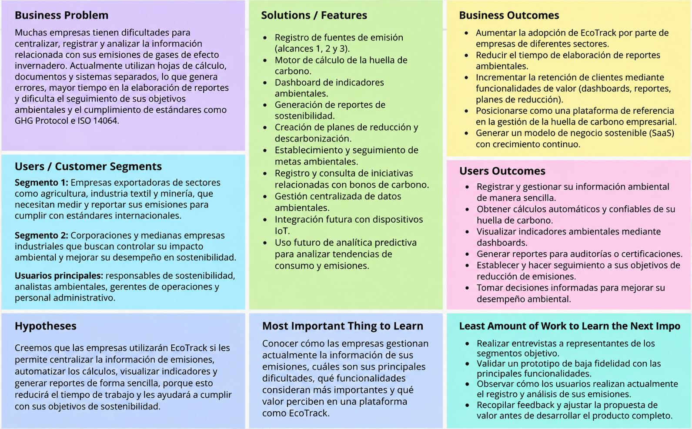

---

## 1.3. Segmentos objetivo

Para EcoTrack se han identificado dos segmentos objetivo principales. Ambos corresponden a organizaciones que necesitan medir, organizar y analizar información relacionada con sus emisiones de gases de efecto invernadero y su desempeño ambiental.

### Segmento 1: Empresas exportadoras

Este segmento está compuesto por empresas exportadoras de sectores como agricultura, industria textil, minería y otras actividades productivas que participan en mercados nacionales e internacionales.

Estas organizaciones pueden generar emisiones relacionadas con transporte, consumo energético, uso de combustibles, operación de maquinaria y procesos productivos. Además, al trabajar con clientes y mercados internacionales, pueden tener una mayor necesidad de demostrar el cumplimiento de estándares ambientales y políticas de sostenibilidad.

Entre sus principales necesidades se encuentran:

- Registrar sus fuentes de emisión.
- Calcular su huella de carbono.
- Organizar información ambiental.
- Generar reportes de sostenibilidad.
- Realizar seguimiento de indicadores ambientales.
- Cumplir con requisitos relacionados con certificaciones o estándares ambientales.

Los principales usuarios dentro de estas empresas serían:

- Responsables de sostenibilidad.
- Analistas ambientales.
- Gerentes de operaciones.
- Personal encargado de calidad.
- Personal encargado de certificaciones.

EcoTrack busca ayudar a este segmento mediante una plataforma que permita centralizar la información ambiental y facilitar el seguimiento de sus emisiones.

### Segmento 2: Corporaciones y medianas empresas industriales

Este segmento está compuesto por corporaciones y medianas empresas industriales que buscan controlar y reducir el impacto ambiental generado por sus operaciones.

Estas organizaciones pueden producir emisiones provenientes del consumo de electricidad, combustibles, transporte, maquinaria, residuos y distintos procesos productivos. Debido a que la información puede provenir de diferentes áreas de la empresa, uno de sus principales problemas es mantener los datos organizados y actualizados.

Entre sus principales necesidades se encuentran:

- Centralizar información proveniente de diferentes áreas.
- Identificar las principales fuentes de emisión.
- Comparar resultados entre diferentes periodos.
- Visualizar indicadores mediante dashboards.
- Establecer metas de reducción de emisiones.
- Realizar seguimiento de sus objetivos ambientales.
- Generar reportes para procesos internos, auditorías o certificaciones.

Los principales usuarios dentro de este segmento serían:

- Gerentes de operaciones.
- Responsables de sostenibilidad.
- Analistas ambientales.
- Supervisores de producción.
- Personal administrativo.

Ambos segmentos comparten la necesidad de contar con información ambiental organizada, comprensible y actualizada que les permita tomar mejores decisiones relacionadas con la reducción de emisiones y la sostenibilidad.

---

# Capítulo II: Requirements Elicitation & Analysis

## 2.1. Competidores

### 2.1.1. Análisis competitivo

<!-- Completar -->

### 2.1.2. Estrategias y tácticas frente a competidores

<!-- Completar -->

---

## 2.2. Entrevistas

### 2.2.1. Diseño de entrevistas

Las preguntas buscan identificar cómo gestionan actualmente la información ambiental, qué dificultades encuentran y qué funcionalidades podrían resultarles más útiles dentro de EcoTrack.

#### Segmento 1: Empresas exportadoras

<!-- Completar -->

### 2.2.2. Registro de entrevistas

<!-- Completar -->

---

### 2.2.3. Análisis de entrevistas

<!-- Completar -->

---

## 2.3. Needfinding

### 2.3.1. User Personas

<!-- Completar -->

### 2.3.2. User Task Matrix

<!-- Completar -->

### 2.3.3. User Journey Mapping

<!-- Completar -->

### 2.3.4. Empathy Mapping

<!-- Completar -->

---

## 2.4. Big Picture Event Storming

<!-- Completar -->

---

## 2.5. Ubiquitous Language

<!-- Completar -->

---

# Capítulo III: Requirements Specification

## 3.1. User Stories

| Epic / Story ID | Título | Descripción | Criterios de Aceptación | Relacionado con (Epic ID) |
|---|---|---|---|---|
| US-01 | Conocer EcoTrack | Como visitante, quiero conocer qué es EcoTrack y cuál es su propósito, para entender cómo puede ayudar a mi empresa con la gestión ambiental. | **Escenario 1:** Given que el visitante accede al sitio de EcoTrack, When consulta la información principal del producto, Then conoce el propósito de la plataforma y el problema que busca resolver.<br><br>**Escenario 2:** Given que el visitante desea conocer más sobre EcoTrack, When revisa la información disponible, Then identifica las principales características de la solución. | EP-01 |
| US-02 | Conocer los beneficios de EcoTrack | Como visitante, quiero conocer los principales beneficios de EcoTrack, para evaluar si la solución puede ser útil para mi empresa. | **Escenario 1:** Given que el visitante está interesado en EcoTrack, When consulta los beneficios del producto, Then conoce cómo la plataforma puede ayudar a centralizar y analizar información ambiental.<br><br>**Escenario 2:** Given que el visitante pertenece a uno de los segmentos objetivo, When revisa los beneficios, Then identifica ventajas relacionadas con la gestión de emisiones y reportes. | EP-01 |
| US-03 | Conocer las funcionalidades principales | Como visitante, quiero conocer las principales funcionalidades de EcoTrack, para saber qué herramientas ofrece la plataforma. | **Escenario 1:** Given que el visitante desea conocer las funciones de EcoTrack, When consulta la información del producto, Then puede identificar funciones relacionadas con emisiones, indicadores, metas y reportes.<br><br>**Escenario 2:** Given que el visitante busca una solución ambiental, When revisa las funcionalidades, Then puede determinar si estas responden a sus necesidades. | EP-01 |
| US-04 | Conocer los planes disponibles | Como visitante, quiero conocer los planes ofrecidos por EcoTrack, para identificar cuál se adapta mejor a las necesidades de mi empresa. | **Escenario 1:** Given que el visitante desea conocer las opciones disponibles, When consulta los planes de EcoTrack, Then puede conocer las características principales de cada alternativa.<br><br>**Escenario 2:** Given que existen diferentes planes, When el visitante los compara, Then puede identificar las diferencias entre ellos. | EP-01 |
| US-05 | Contactar al equipo de EcoTrack | Como visitante, quiero enviar una consulta al equipo de EcoTrack, para solicitar más información sobre el producto. | **Escenario 1:** Given que el visitante desea contactar al equipo, When proporciona información válida y envía su consulta, Then la solicitud queda registrada.<br><br>**Escenario 2:** Given que falta información necesaria, When el visitante intenta enviar la consulta, Then la solicitud no se registra hasta completar los datos requeridos. | EP-01 |
| US-06 | Registrar una empresa | Como representante de una empresa, quiero registrar mi organización en EcoTrack, para comenzar a gestionar su información ambiental. | **Escenario 1:** Given que la empresa todavía no se encuentra registrada, When el usuario proporciona los datos requeridos, Then la empresa queda registrada en EcoTrack.<br><br>**Escenario 2:** Given que existen datos obligatorios sin completar, When el usuario intenta registrar la empresa, Then el registro no se completa. | EP-02 |
| US-07 | Iniciar sesión | Como usuario registrado, quiero iniciar sesión en EcoTrack, para acceder a la información de mi empresa. | **Escenario 1:** Given que el usuario posee credenciales válidas, When inicia sesión, Then obtiene acceso a las funciones correspondientes a su cuenta.<br><br>**Escenario 2:** Given que las credenciales no son válidas, When el usuario intenta iniciar sesión, Then el acceso es rechazado. | EP-02 |
| US-08 | Recuperar contraseña | Como usuario registrado, quiero recuperar el acceso a mi cuenta si olvido mi contraseña, para poder continuar utilizando EcoTrack. | **Escenario 1:** Given que el usuario posee una cuenta registrada, When solicita recuperar su contraseña utilizando un correo válido, Then recibe las indicaciones necesarias para recuperar el acceso.<br><br>**Escenario 2:** Given que el correo no corresponde a una cuenta registrada, When solicita la recuperación, Then el sistema informa que no puede continuar con el proceso. | EP-02 |
| US-09 | Consultar perfil de la empresa | Como usuario de EcoTrack, quiero consultar los datos de mi empresa, para verificar que la información registrada sea correcta. | **Escenario 1:** Given que el usuario pertenece a una empresa registrada, When consulta el perfil de la organización, Then puede revisar sus datos registrados.<br><br>**Escenario 2:** Given que la empresa cuenta con información registrada, When el usuario consulta su perfil, Then los datos corresponden a la organización asociada a su cuenta. | EP-02 |
| US-10 | Actualizar datos de la empresa | Como usuario autorizado, quiero actualizar los datos de mi empresa, para mantener su información al día. | **Escenario 1:** Given que el usuario cuenta con permisos para modificar la información, When actualiza datos válidos, Then los cambios quedan registrados.<br><br>**Escenario 2:** Given que existen datos obligatorios inválidos, When intenta guardar los cambios, Then la información anterior se mantiene hasta corregirlos. | EP-02 |
| US-11 | Registrar una fuente de emisión | Como analista ambiental, quiero registrar una fuente de emisión, para llevar un control de las actividades que generan emisiones en la empresa. | **Escenario 1:** Given que el analista cuenta con información de una actividad generadora de emisiones, When registra los datos requeridos, Then la fuente queda almacenada.<br><br>**Escenario 2:** Given que faltan datos obligatorios, When intenta registrar la fuente, Then el registro no se completa. | EP-03 |
| US-12 | Clasificar una emisión por alcance | Como analista ambiental, quiero clasificar una emisión como alcance 1, 2 o 3, para organizar correctamente la información ambiental. | **Escenario 1:** Given que existe una fuente de emisión, When el analista selecciona su alcance correspondiente, Then la emisión queda asociada a dicha clasificación.<br><br>**Escenario 2:** Given que una emisión no posee alcance definido, When se intenta completar su registro, Then se solicita una clasificación válida. | EP-03 |
| US-13 | Consultar emisiones registradas | Como responsable de sostenibilidad, quiero consultar las emisiones registradas, para conocer las actividades que generan emisiones dentro de la empresa. | **Escenario 1:** Given que existen emisiones registradas, When el usuario consulta los registros, Then puede acceder a la información de las emisiones de su empresa.<br><br>**Escenario 2:** Given que no existen emisiones registradas, When el usuario realiza la consulta, Then se informa que todavía no existen registros. | EP-03 |
| US-14 | Editar una emisión | Como analista ambiental, quiero modificar una emisión registrada, para corregir información incorrecta o desactualizada. | **Escenario 1:** Given que existe una emisión registrada, When el analista modifica sus datos con valores válidos, Then la información queda actualizada.<br><br>**Escenario 2:** Given que los nuevos datos no son válidos, When intenta guardar los cambios, Then la información anterior se mantiene. | EP-03 |
| US-15 | Eliminar una emisión | Como analista ambiental, quiero eliminar una emisión incorrecta, para evitar que información no válida afecte los resultados ambientales. | **Escenario 1:** Given que existe una emisión registrada, When el analista confirma su eliminación, Then la emisión deja de formar parte de los registros activos.<br><br>**Escenario 2:** Given que el analista no confirma la eliminación, When cancela la operación, Then la emisión permanece registrada. | EP-03 |
| US-16 | Visualizar total de emisiones | Como responsable de sostenibilidad, quiero conocer el total de emisiones registradas, para tener una visión general del impacto ambiental de la empresa. | **Escenario 1:** Given que existen emisiones registradas, When el usuario consulta el resumen ambiental, Then obtiene el total correspondiente.<br><br>**Escenario 2:** Given que se registra una nueva emisión, When se actualiza la información ambiental, Then el total considera el nuevo registro. | EP-04 |
| US-17 | Visualizar emisiones por alcance | Como responsable de sostenibilidad, quiero conocer las emisiones correspondientes a cada alcance, para identificar qué categoría tiene mayor impacto. | **Escenario 1:** Given que existen emisiones clasificadas, When el usuario consulta la distribución por alcance, Then obtiene los resultados correspondientes a los alcances 1, 2 y 3.<br><br>**Escenario 2:** Given que un alcance no posee registros, When se consulta la distribución, Then su valor se presenta sin emisiones registradas. | EP-04 |
| US-18 | Buscar una emisión | Como usuario de EcoTrack, quiero buscar una emisión registrada, para encontrar información específica rápidamente. | **Escenario 1:** Given que existe una emisión relacionada con el término buscado, When el usuario realiza una búsqueda, Then obtiene los registros coincidentes.<br><br>**Escenario 2:** Given que no existe una coincidencia, When realiza la búsqueda, Then se informa que no existen resultados relacionados. | EP-04 |
| US-19 | Filtrar emisiones por alcance | Como responsable de sostenibilidad, quiero filtrar las emisiones según su alcance, para analizar cada categoría por separado. | **Escenario 1:** Given que existen emisiones de diferentes alcances, When el usuario selecciona un alcance, Then obtiene únicamente las emisiones correspondientes.<br><br>**Escenario 2:** Given que existe un filtro aplicado, When el usuario decide consultar todas las emisiones, Then vuelve a obtener el conjunto completo de registros. | EP-04 |
| US-20 | Comparar emisiones por periodo | Como responsable de sostenibilidad, quiero comparar las emisiones entre diferentes periodos, para conocer cómo ha cambiado el desempeño ambiental de la empresa. | **Escenario 1:** Given que existen registros de diferentes periodos, When el usuario selecciona dos periodos para comparar, Then obtiene los resultados de ambos.<br><br>**Escenario 2:** Given que un periodo no posee información suficiente, When se realiza la comparación, Then se informa la falta de datos para dicho periodo. | EP-04 |
| US-21 | Registrar una meta ambiental | Como responsable de sostenibilidad, quiero registrar una meta de reducción de emisiones, para establecer un objetivo ambiental para la empresa. | **Escenario 1:** Given que el usuario desea establecer una meta, When registra un objetivo y una fecha válida, Then la meta queda registrada.<br><br>**Escenario 2:** Given que los datos de la meta están incompletos, When intenta registrarla, Then el registro no se completa. | EP-05 |
| US-22 | Consultar metas ambientales | Como responsable de sostenibilidad, quiero consultar las metas ambientales de la empresa, para conocer los objetivos establecidos. | **Escenario 1:** Given que existen metas registradas, When el usuario consulta las metas ambientales, Then puede conocer sus principales datos y estado.<br><br>**Escenario 2:** Given que no existen metas registradas, When realiza la consulta, Then se informa que todavía no existen objetivos definidos. | EP-05 |
| US-23 | Editar una meta ambiental | Como responsable de sostenibilidad, quiero modificar una meta ambiental, para mantener sus objetivos actualizados. | **Escenario 1:** Given que existe una meta registrada, When el usuario modifica sus datos con información válida, Then la meta queda actualizada.<br><br>**Escenario 2:** Given que los nuevos datos no son válidos, When intenta guardar los cambios, Then la información anterior se conserva. | EP-05 |
| US-24 | Actualizar estado de una meta | Como responsable de sostenibilidad, quiero actualizar el estado de una meta, para indicar si continúa pendiente o ya fue completada. | **Escenario 1:** Given que existe una meta activa, When el usuario registra que fue alcanzada, Then la meta queda identificada como completada.<br><br>**Escenario 2:** Given que una meta continúa en desarrollo, When el usuario consulta su estado, Then permanece registrada como activa. | EP-05 |
| US-25 | Eliminar una meta | Como responsable de sostenibilidad, quiero eliminar una meta que ya no sea necesaria, para mantener actualizados los objetivos ambientales. | **Escenario 1:** Given que existe una meta registrada, When el usuario confirma su eliminación, Then la meta deja de formar parte de los objetivos activos.<br><br>**Escenario 2:** Given que el usuario cancela la eliminación, When finaliza la operación, Then la meta permanece registrada. | EP-05 |
| US-26 | Consultar resumen ambiental | Como responsable de sostenibilidad, quiero consultar un resumen de la información ambiental, para conocer los principales resultados de la empresa en un solo lugar. | **Escenario 1:** Given que existen datos ambientales registrados, When el usuario solicita el resumen, Then obtiene información sobre emisiones y metas ambientales.<br><br>**Escenario 2:** Given que se actualizan los registros ambientales, When se consulta nuevamente el resumen, Then los resultados consideran los datos actualizados. | EP-06 |
| US-27 | Generar reporte ambiental | Como responsable de sostenibilidad, quiero generar un reporte ambiental, para reunir los principales resultados de la empresa. | **Escenario 1:** Given que existen datos ambientales registrados, When el usuario solicita generar un reporte, Then se crea un reporte con la información correspondiente.<br><br>**Escenario 2:** Given que no existe información suficiente, When intenta generar el reporte, Then se informa que faltan datos para completar el documento. | EP-06 |
| US-28 | Descargar reporte ambiental | Como responsable de sostenibilidad, quiero descargar un reporte generado, para conservarlo o compartirlo con otras personas de la organización. | **Escenario 1:** Given que existe un reporte generado, When el usuario solicita su descarga, Then obtiene el documento correspondiente.<br><br>**Escenario 2:** Given que todavía no existe un reporte generado, When intenta descargarlo, Then se informa que primero debe existir un reporte disponible. | EP-06 |
| US-29 | Generar reporte por periodo | Como responsable de sostenibilidad, quiero generar un reporte correspondiente a un periodo específico, para analizar los resultados ambientales de ese intervalo. | **Escenario 1:** Given que existen datos dentro del periodo seleccionado, When el usuario genera el reporte, Then el documento considera únicamente dicha información.<br><br>**Escenario 2:** Given que el periodo seleccionado no contiene registros, When se solicita el reporte, Then se informa que no existen datos disponibles para ese intervalo. | EP-06 |
| US-30 | Consultar reportes anteriores | Como responsable de sostenibilidad, quiero consultar los reportes generados anteriormente, para revisar información ambiental de periodos anteriores. | **Escenario 1:** Given que existen reportes generados previamente, When el usuario consulta el historial, Then puede acceder a los reportes disponibles.<br><br>**Escenario 2:** Given que todavía no existen reportes anteriores, When consulta el historial, Then se informa que no existen documentos registrados. | EP-06 |

### Epics

Las User Stories fueron agrupadas en seis Epics que representan las principales áreas funcionales consideradas para EcoTrack.

| Epic ID | Título | Descripción |
|---|---|---|
| EP-01 | Landing Page e información de EcoTrack | Reúne las funcionalidades destinadas a presentar EcoTrack, sus beneficios, características y planes a los visitantes interesados en la solución. |
| EP-02 | Gestión de cuenta y empresa | Agrupa las funcionalidades relacionadas con el acceso a EcoTrack y la administración de la información básica de la empresa. |
| EP-03 | Gestión de emisiones | Comprende las funcionalidades necesarias para registrar, clasificar, consultar, editar y eliminar información relacionada con las emisiones de la organización. |
| EP-04 | Dashboard y análisis de emisiones | Agrupa las funcionalidades orientadas a consultar indicadores, buscar información, aplicar filtros y comparar el comportamiento de las emisiones. |
| EP-05 | Gestión de metas ambientales | Comprende las funcionalidades relacionadas con la creación, consulta y seguimiento de los objetivos de reducción de emisiones de la organización. |
| EP-06 | Reportes ambientales | Agrupa las funcionalidades relacionadas con la consulta de resultados ambientales y la generación, descarga y revisión de reportes. |

---

## 3.2. Impact Mapping

<!-- Completar -->

---

## 3.3. Product Backlog

| Orden | ID | Título | Epic | Prioridad | Story Points | Estado |
|---:|---|---|---|---|---:|---|
| 1 | US-01 | Conocer EcoTrack | EP-01 | Alta | 2 | Pendiente |
| 2 | US-02 | Conocer los beneficios de EcoTrack | EP-01 | Media | 2 | Pendiente |
| 3 | US-03 | Conocer las funcionalidades principales | EP-01 | Media | 2 | Pendiente |
| 4 | US-04 | Conocer los planes disponibles | EP-01 | Baja | 2 | Pendiente |
| 5 | US-05 | Contactar al equipo de EcoTrack | EP-01 | Media | 3 | Pendiente |
| 6 | US-06 | Registrar una empresa | EP-02 | Alta | 5 | Pendiente |
| 7 | US-07 | Iniciar sesión | EP-02 | Alta | 5 | Pendiente |
| 8 | US-08 | Recuperar contraseña | EP-02 | Media | 3 | Pendiente |
| 9 | US-09 | Consultar perfil de la empresa | EP-02 | Media | 2 | Pendiente |
| 10 | US-10 | Actualizar datos de la empresa | EP-02 | Media | 3 | Pendiente |
| 11 | US-11 | Registrar una fuente de emisión | EP-03 | Alta | 5 | Pendiente |
| 12 | US-12 | Clasificar una emisión por alcance | EP-03 | Alta | 3 | Pendiente |
| 13 | US-13 | Consultar emisiones registradas | EP-03 | Alta | 3 | Pendiente |
| 14 | US-14 | Editar una emisión | EP-03 | Alta | 3 | Pendiente |
| 15 | US-15 | Eliminar una emisión | EP-03 | Media | 2 | Pendiente |
| 16 | US-16 | Visualizar total de emisiones | EP-04 | Alta | 3 | Pendiente |
| 17 | US-17 | Visualizar emisiones por alcance | EP-04 | Alta | 5 | Pendiente |
| 18 | US-18 | Buscar una emisión | EP-04 | Media | 2 | Pendiente |
| 19 | US-19 | Filtrar emisiones por alcance | EP-04 | Media | 3 | Pendiente |
| 20 | US-20 | Comparar emisiones por periodo | EP-04 | Media | 5 | Pendiente |
| 21 | US-21 | Registrar una meta ambiental | EP-05 | Alta | 3 | Pendiente |
| 22 | US-22 | Consultar metas ambientales | EP-05 | Alta | 3 | Pendiente |
| 23 | US-23 | Editar una meta ambiental | EP-05 | Media | 3 | Pendiente |
| 24 | US-24 | Actualizar estado de una meta | EP-05 | Media | 2 | Pendiente |
| 25 | US-25 | Eliminar una meta | EP-05 | Baja | 2 | Pendiente |
| 26 | US-26 | Consultar resumen ambiental | EP-06 | Alta | 3 | Pendiente |
| 27 | US-27 | Generar reporte ambiental | EP-06 | Alta | 5 | Pendiente |
| 28 | US-28 | Descargar reporte ambiental | EP-06 | Media | 3 | Pendiente |
| 29 | US-29 | Generar reporte por periodo | EP-06 | Media | 5 | Pendiente |
| 30 | US-30 | Consultar reportes anteriores | EP-06 | Baja | 3 | Pendiente |

### Epics relacionados

| Epic ID | Epic |
|---|---|
| EP-01 | Landing Page e información de EcoTrack |
| EP-02 | Gestión de cuenta y empresa |
| EP-03 | Gestión de emisiones |
| EP-04 | Dashboard y análisis de emisiones |
| EP-05 | Gestión de metas ambientales |
| EP-06 | Reportes ambientales |

---

# Capítulo IV: Product Design

## 4.1. Style Guidelines

### 4.1.1. General Style Guidelines

La identidad visual de EcoTrack ha sido planteada para transmitir sostenibilidad, tecnología, confianza y profesionalismo. Estas características se relacionan con la naturaleza del producto, ya que EcoTrack es una plataforma web B2B orientada a la gestión de la huella de carbono y de información ambiental en organizaciones.

Como referencia para mantener consistencia visual, legibilidad y facilidad de uso en los diferentes productos digitales, se consideran principios de Material Design. A partir de ello, se establecen lineamientos generales relacionados con el Branding, la Color Palette, la Typography, el Spacing y el Tone of Voice de EcoTrack.

#### Branding

La identidad de EcoTrack combina conceptos relacionados con sostenibilidad, monitoreo ambiental y análisis de información. El nombre de la marca se acompaña de un elemento gráfico simple que busca representar el seguimiento y análisis de indicadores relacionados con la huella de carbono.

La identidad visual busca mantener una apariencia moderna y profesional, acorde con una plataforma utilizada por organizaciones que necesitan registrar, analizar y monitorear sus emisiones de gases de efecto invernadero.

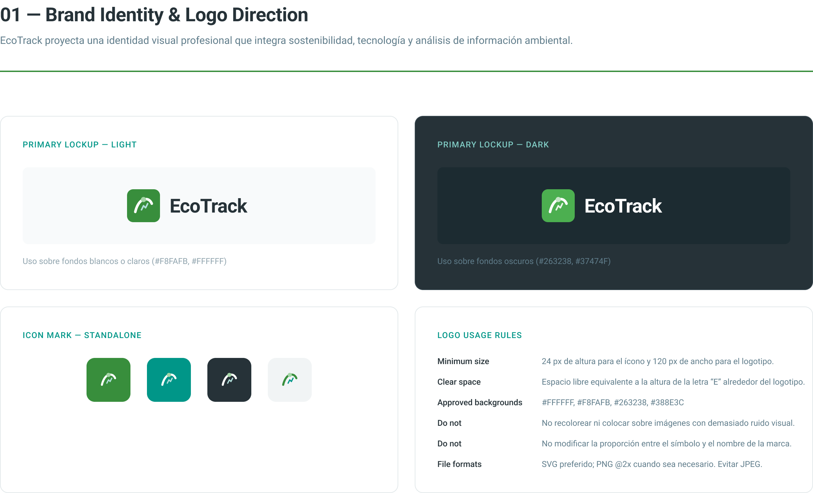

#### Color Palette

La paleta de colores de EcoTrack está compuesta principalmente por tonalidades verdes y teal. El verde se utiliza como color principal por su asociación con sostenibilidad y gestión ambiental, mientras que el teal complementa la identidad al aportar una percepción relacionada con tecnología, información y análisis de datos.

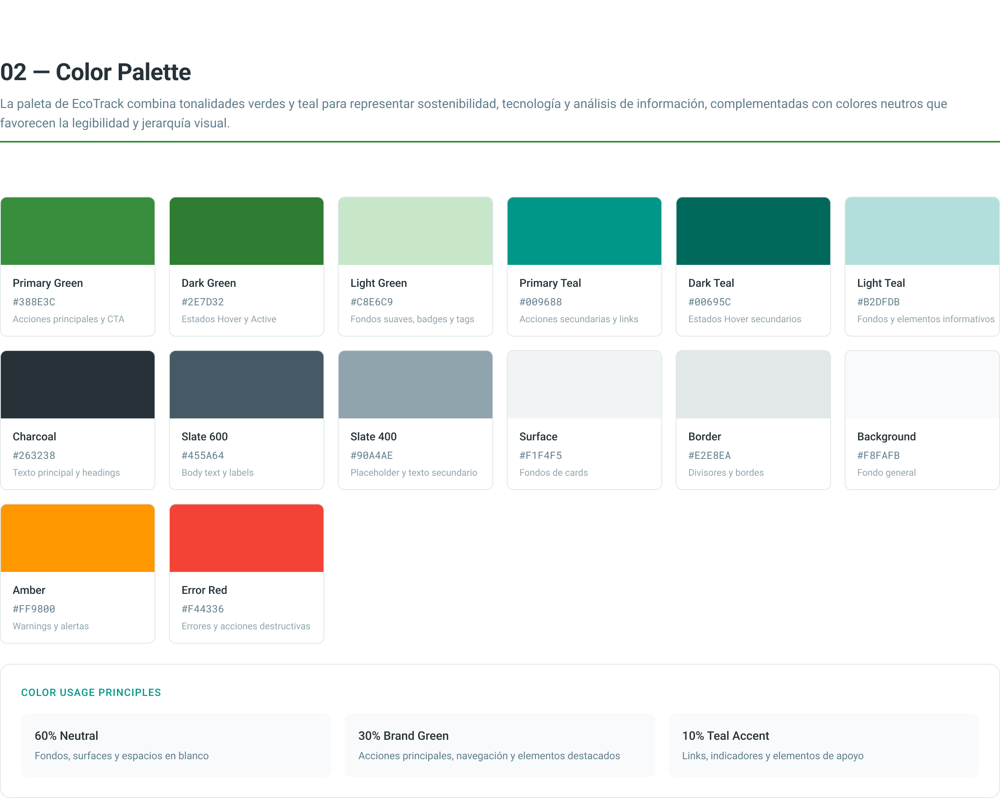

#### Typography

Roboto será la tipografía principal utilizada en EcoTrack debido a su legibilidad en interfaces digitales y su relación con los principios de Material Design. Se utiliza una jerarquía tipográfica que permite diferenciar títulos, subtítulos, contenido descriptivo, etiquetas y datos.

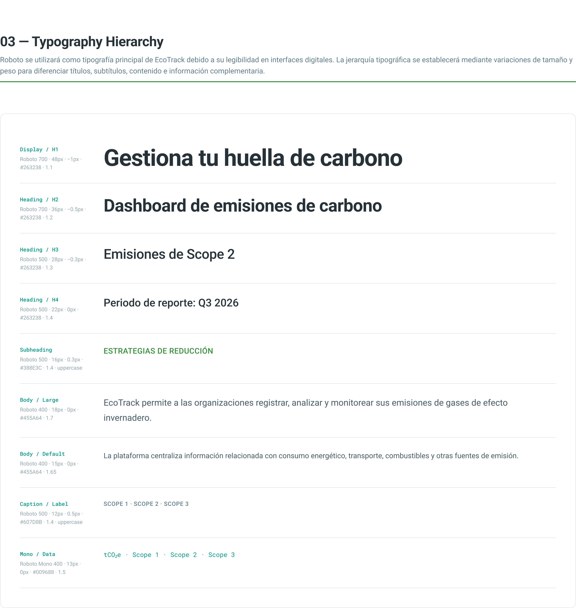

#### Spacing

EcoTrack utiliza un sistema de espaciado basado en múltiplos de 8 px con el objetivo de mantener consistencia entre componentes, secciones y diferentes resoluciones de pantalla.

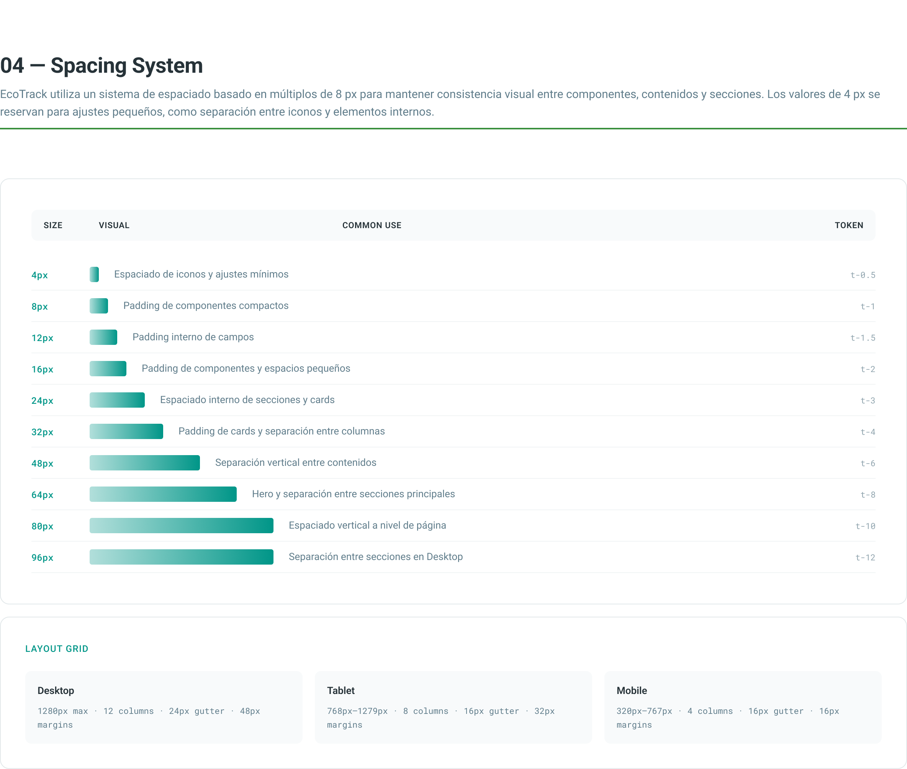

#### Tone of Voice

EcoTrack utiliza un tono profesional, claro, confiable y orientado a datos. La comunicación busca facilitar la comprensión de información ambiental y apoyar la toma de decisiones, evitando mensajes ambiguos, exagerados o que atribuyan capacidades que la plataforma no ofrece.

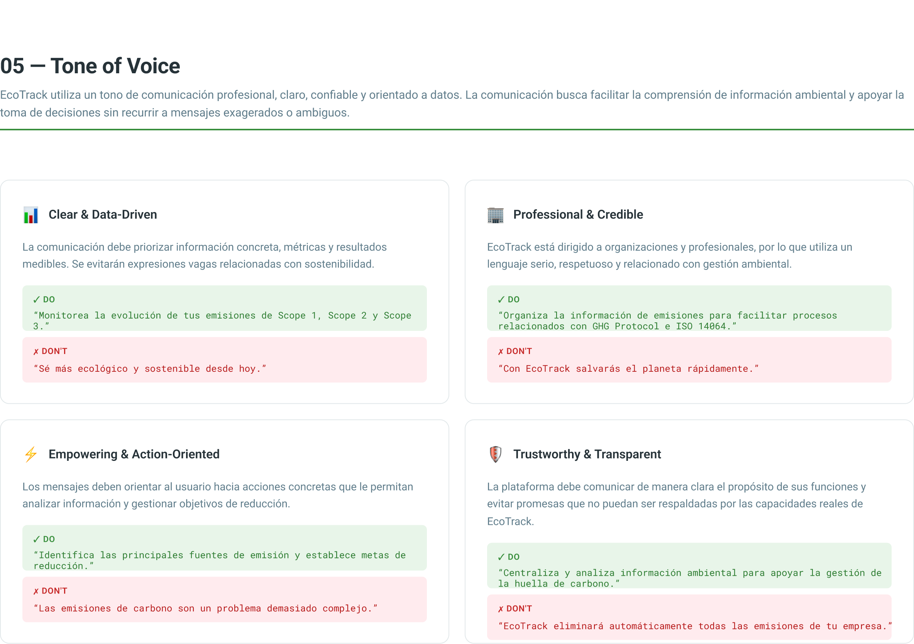

### 4.1.2. Web Style Guidelines

Los Web Style Guidelines de EcoTrack definen la aplicación práctica de la identidad visual en componentes de interfaz web responsive. Estos lineamientos consideran botones, cards, campos de formulario y criterios de adaptación a diferentes resoluciones de pantalla, manteniendo coherencia con los principios de Material Design y con la identidad visual establecida previamente.

#### Button Components

Los botones de EcoTrack siguen una jerarquía visual que permite diferenciar acciones principales, secundarias y complementarias. Los estados de interacción mantienen una respuesta visual consistente para facilitar la identificación de acciones disponibles dentro de la interfaz.

Los botones principales utilizan Primary Green para resaltar acciones relevantes, mientras que los secundarios utilizan variantes outlined, text o teal según el nivel de jerarquía requerido. Asimismo, se consideran estados Hover, Active y Disabled para mantener claridad durante la interacción del usuario.

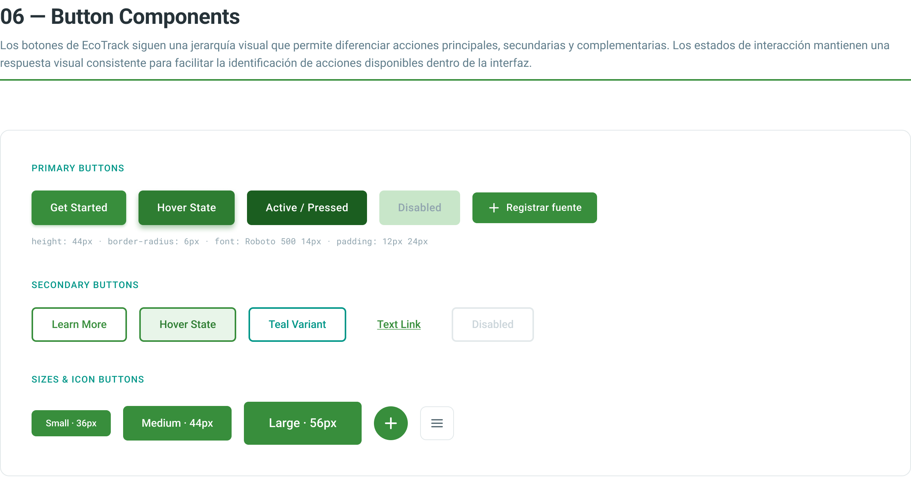

#### Cards & Form Fields

Las Cards y los Form Fields de EcoTrack mantienen una estructura visual simple, legible y consistente con Material Design. Los componentes utilizan bordes suaves, separación clara entre contenidos y estados visuales que permiten identificar acciones, datos y posibles errores.

Las cards se utilizan para mostrar indicadores, información resumida y funcionalidades relacionadas con la gestión de emisiones, mientras que los formularios facilitan la interacción de usuarios interesados en registrar información o solicitar contacto con la plataforma.

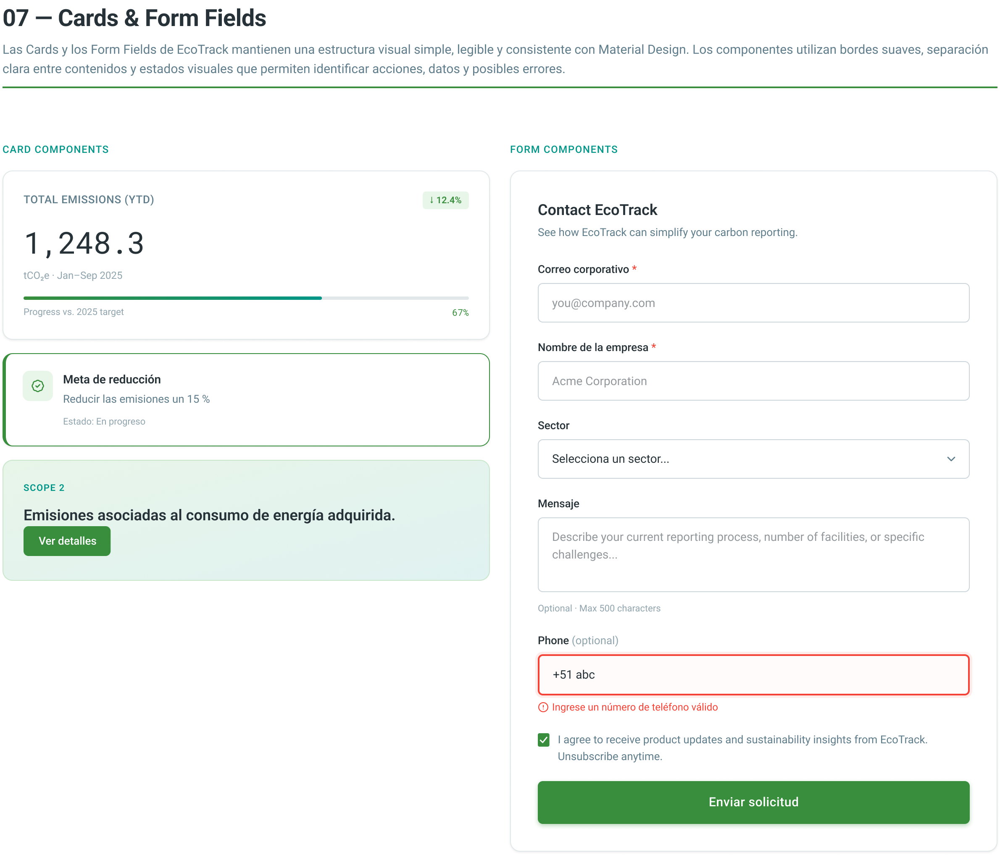

#### Responsive Behavior

Los componentes web de EcoTrack se adaptan a diferentes resoluciones de pantalla para mantener legibilidad, jerarquía visual y facilidad de interacción. En Desktop, Tablet y Mobile se conserva consistencia visual en botones, cards y formularios, reorganizando el contenido según el espacio disponible.

En Desktop se aprovecha una distribución más amplia en columnas; en Tablet se reduce el número de columnas manteniendo separación y jerarquía; y en Mobile los componentes se organizan principalmente en una sola columna, priorizando la interacción táctil y la claridad del contenido.

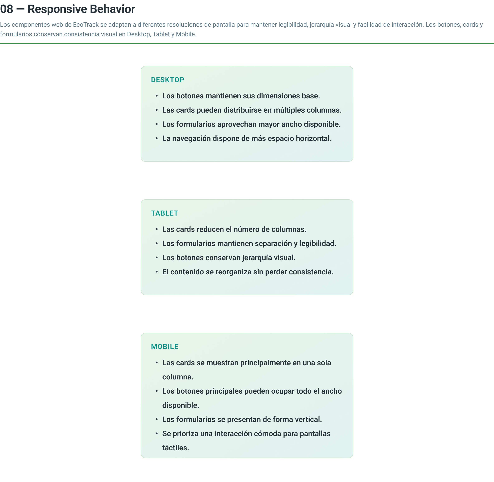
---

## 4.2. Information Architecture

La Information Architecture de EcoTrack busca organizar el contenido de los productos digitales de manera clara y predecible, permitiendo que visitantes y usuarios puedan identificar rápidamente la información y las funcionalidades disponibles.

Para ello, se consideran sistemas de organización jerárquicos, secuenciales y por tópicos, aplicados de acuerdo con el tipo de contenido presentado tanto en el Landing Page como en la Web Application.

### 4.2.1. Organization Systems

En la Landing Page de EcoTrack se empleará principalmente una organización jerárquica y secuencial.

La organización jerárquica permite priorizar la información más relevante para el visitante. El recorrido comienza con la presentación de la marca y la propuesta de valor de EcoTrack, seguido del problema que busca resolver, sus principales beneficios, funcionalidades, clasificación de emisiones, funcionamiento general de la plataforma, estándares considerados, planes de suscripción y finalmente las acciones de contacto.

Por otro lado, la organización secuencial permite que el visitante recorra el contenido progresivamente de arriba hacia abajo, facilitando la comprensión de la propuesta antes de llegar a las llamadas a la acción.

Asimismo, se emplea una organización por tópicos para agrupar contenido relacionado. Dentro de la sección Features, las funcionalidades se organizan en registro de emisiones, cálculo de huella de carbono, dashboard de indicadores, metas de reducción y reportes. Del mismo modo, las emisiones se agrupan según Scope 1, Scope 2 y Scope 3.

La estructura general planteada para el Landing Page sigue el siguiente orden:

1. Navbar
2. Hero / Propuesta de valor
3. Problema y beneficios
4. Features
5. Emission Scopes
6. How It Works
7. Standards
8. Plans
9. Call To Action
10. Footer

La sección Plans permitirá presentar las alternativas de suscripción de EcoTrack de acuerdo con el modelo SaaS planteado para la solución. En esta etapa todavía no se especifican nombres, precios o características particulares de los planes, debido a que estos deberán definirse posteriormente como parte del modelo de negocio.

En la Web Application se mantendrá una estructura jerárquica basada en los principales módulos funcionales de EcoTrack, como Dashboard, Emissions, Goals y Reports. Cuando corresponda, los registros podrán organizarse cronológicamente para facilitar la consulta de información asociada a distintos periodos.

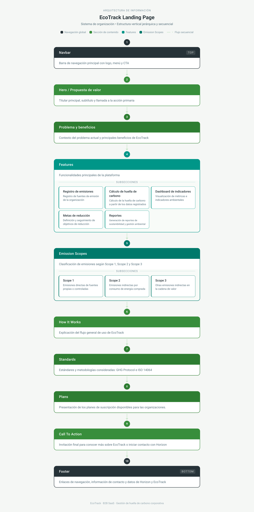

### 4.2.2. Labeling Systems

El Labeling System de EcoTrack busca representar la información y las acciones mediante etiquetas breves, claras y consistentes, reduciendo la posibilidad de confusión durante la navegación.

En la Landing Page se utilizarán etiquetas reconocibles para identificar las principales secciones de contenido. Entre ellas se consideran Home, Features, How It Works, Emission Scopes, Standards, Plans y Contact. Asimismo, las llamadas a la acción utilizarán etiquetas como Get Started y Learn More, permitiendo que el visitante identifique rápidamente la acción esperada.

En la Web Application se utilizarán etiquetas asociadas directamente con los principales módulos funcionales de EcoTrack, como Dashboard, Emissions, Goals, Reports, Organization y Profile. Dentro del módulo Emissions se mantendrán las etiquetas Scope 1, Scope 2 y Scope 3 para representar la clasificación de emisiones considerada por la plataforma.

Las acciones dentro de la interfaz utilizarán labels cortos y consistentes, por ejemplo Add Emission, View Details, Generate Report, Create Goal, Edit, Delete, Save y Cancel. De esta manera, una misma acción conservará la misma denominación en diferentes partes del producto.

La selección de estas etiquetas busca mantener simplicidad, facilitar el reconocimiento de la información y mantener una terminología coherente entre el Landing Page y la Web Application.

| Contexto | Labels principales |
| --- | --- |
| Landing Page | Home, Features, How It Works, Emission Scopes, Standards, Plans, Contact |
| Call To Action | Get Started, Learn More |
| Web Application | Dashboard, Emissions, Goals, Reports, Organization, Profile |
| Emission Categories | Scope 1, Scope 2, Scope 3 |
| Actions | Add Emission, View Details, Generate Report, Create Goal, Edit, Delete, Save, Cancel |

### 4.2.3. SEO Tags and Meta Tags

Los SEO Tags y Meta Tags de EcoTrack permiten describir e identificar el contenido principal de las páginas que forman parte de la experiencia web. Estos elementos serán definidos tanto para el Landing Page como para las principales páginas de la Web Application, manteniendo una terminología relacionada con sostenibilidad, gestión ambiental y huella de carbono.

Para las páginas principales se consideran elementos como Title, Description, Keywords y Author. Asimismo, se incluyen configuraciones básicas relacionadas con la codificación de caracteres y la adaptación responsive de las interfaces.

#### Landing Page

El Landing Page de EcoTrack utilizará los siguientes SEO Tags y Meta Tags:

```html
<title>EcoTrack | Gestión de Huella de Carbono</title>

<meta
  name="description"
  content="EcoTrack es una plataforma web B2B que permite a las organizaciones centralizar, analizar y gestionar información relacionada con su huella de carbono."
>

<meta
  name="keywords"
  content="EcoTrack, huella de carbono, emisiones GEI, sostenibilidad empresarial, gestión ambiental, Scope 1, Scope 2, Scope 3, GHG Protocol, ISO 14064"
>

<meta name="author" content="Horizon">
```

El Title permite identificar a EcoTrack y relacionarlo directamente con la gestión de la huella de carbono. La Description resume la propuesta principal de la plataforma, mientras que Keywords incluye términos relacionados con el dominio del producto, los tipos de emisiones considerados y los principales estándares ambientales contemplados.

#### Web Application - Dashboard

La página principal de la Web Application permitirá visualizar indicadores relacionados con la información ambiental registrada por la organización.

```html
<title>Dashboard | EcoTrack</title>

<meta
  name="description"
  content="Visualiza indicadores ambientales y consulta información relacionada con las emisiones registradas por la organización en EcoTrack."
>

<meta
  name="keywords"
  content="EcoTrack, dashboard ambiental, indicadores ambientales, emisiones, huella de carbono"
>

<meta name="author" content="Horizon">
```

#### Web Application - Emissions

La sección Emissions estará orientada al registro y consulta de las fuentes de emisión consideradas por la organización.

```html
<title>Emissions | EcoTrack</title>

<meta
  name="description"
  content="Registra y consulta información relacionada con las fuentes de emisión de Scope 1, Scope 2 y Scope 3 de la organización."
>

<meta
  name="keywords"
  content="EcoTrack, emisiones, Scope 1, Scope 2, Scope 3, gases de efecto invernadero"
>

<meta name="author" content="Horizon">
```

#### Web Application - Goals

La sección Goals permitirá gestionar los objetivos ambientales y realizar seguimiento de las metas de reducción de emisiones definidas por la organización.

```html
<title>Goals | EcoTrack</title>

<meta
  name="description"
  content="Define y realiza seguimiento de los objetivos de reducción de emisiones establecidos por la organización."
>

<meta
  name="keywords"
  content="EcoTrack, metas ambientales, reducción de emisiones, sostenibilidad, objetivos ambientales"
>

<meta name="author" content="Horizon">
```

#### Web Application - Reports

La sección Reports estará orientada a la consulta y generación de reportes relacionados con la información ambiental almacenada en EcoTrack.

```html
<title>Reports | EcoTrack</title>

<meta
  name="description"
  content="Consulta y genera reportes relacionados con la huella de carbono y la gestión ambiental de la organización."
>

<meta
  name="keywords"
  content="EcoTrack, reportes ambientales, huella de carbono, sostenibilidad, emisiones"
>

<meta name="author" content="Horizon">
```

#### General Meta Tags

Todas las páginas que forman parte de la experiencia web de EcoTrack considerarán configuraciones básicas para asegurar una correcta interpretación del contenido y su adaptación a diferentes dispositivos.

```html
<meta charset="UTF-8">
<meta name="viewport" content="width=device-width, initial-scale=1.0">
```

El uso de `UTF-8` permite representar correctamente los caracteres utilizados dentro de la interfaz, mientras que el Meta Tag `viewport` permite adaptar el contenido al ancho disponible en dispositivos Desktop, Tablet y Mobile.

### 4.2.4. Searching Systems

El Searching System de EcoTrack estará orientado principalmente a la Web Application, debido a que los usuarios deberán consultar información ambiental acumulada a lo largo del tiempo, como registros de emisiones, metas ambientales y reportes.

En la Landing Page no se implementará un sistema de búsqueda interno, ya que el contenido se encontrará organizado de forma secuencial y podrá recorrerse mediante las opciones disponibles en el Navbar. De esta manera, los visitantes podrán acceder directamente a secciones como Features, Emission Scopes, How It Works, Standards, Plans y Contact sin necesidad de utilizar un buscador.

En la Web Application se utilizarán mecanismos de búsqueda y filtrado de acuerdo con el tipo de información disponible en cada módulo.

#### Emissions

El módulo Emissions permitirá localizar registros relacionados con las fuentes de emisión de la organización. Los usuarios podrán utilizar una búsqueda textual para encontrar registros a partir del nombre o información asociada a la fuente de emisión.

Asimismo, se considerarán filtros como:

- Scope de emisión: Scope 1, Scope 2 o Scope 3.
- Periodo de registro.
- Fuente de emisión.

Los resultados serán presentados de manera estructurada en una tabla, permitiendo visualizar la información principal de cada registro y acceder a sus respectivos detalles.

#### Dashboard

El Dashboard no requerirá una búsqueda textual tradicional. En su lugar, se utilizarán filtros que permitan modificar la información presentada en los indicadores y visualizaciones.

Entre los filtros considerados se encuentran:

- Periodo de análisis.
- Scope de emisión.

Esto permitirá que el usuario consulte los indicadores correspondientes a diferentes periodos y tipos de emisiones sin abandonar el Dashboard.

#### Goals

En el módulo Goals, los usuarios podrán localizar las metas ambientales registradas mediante su nombre y aplicar filtros relacionados con su estado o periodo.

Los resultados se mostrarán mediante una lista estructurada de metas, incluyendo información relevante para facilitar el seguimiento de los objetivos de reducción establecidos por la organización.

#### Reports

El módulo Reports permitirá buscar los reportes generados dentro de EcoTrack y consultar aquellos asociados a diferentes periodos.

Se considerarán opciones como:

- Búsqueda por nombre del reporte.
- Filtro por periodo.

Los resultados serán presentados en una lista organizada que permitirá identificar el reporte y acceder a su información correspondiente.

#### Presentation of Search Results

Los resultados de búsqueda y filtrado deberán mantener una presentación clara y consistente con el Design System de EcoTrack. Las tablas, listas y demás componentes utilizados deberán mostrar únicamente la información necesaria para identificar cada elemento y acceder posteriormente a información más detallada.

Cuando una búsqueda o combinación de filtros no encuentre resultados, la interfaz mostrará un mensaje informativo que indique al usuario que no existen registros coincidentes, permitiéndole modificar o eliminar los criterios utilizados.

De esta manera, el Searching System busca reducir el esfuerzo necesario para localizar información ambiental dentro de EcoTrack y evitar que los usuarios se sientan desorientados cuando el volumen de registros aumente.

### 4.2.5. Navigation Systems

El Navigation System de EcoTrack busca permitir que visitantes y usuarios puedan desplazarse entre las diferentes secciones y funcionalidades de forma clara, predecible y consistente.

La navegación se adaptará al tipo de producto utilizado. El Landing Page estará orientado principalmente a presentar EcoTrack y guiar al visitante hacia información relevante y acciones de contacto, mientras que la Web Application permitirá acceder a los diferentes módulos relacionados con la gestión de información ambiental.

#### Landing Page Navigation

El Landing Page utilizará una navegación principalmente secuencial y mediante enlaces internos hacia sus diferentes secciones.

El Navbar permitirá acceder directamente a las principales áreas de contenido mediante las siguientes etiquetas:

- Home
- Features
- How It Works
- Standards
- Plans
- Contact

Al seleccionar una opción del Navbar, el visitante será dirigido hacia la sección correspondiente dentro del mismo Landing Page.

Además del Navbar, se utilizarán Call To Action ubicados en puntos relevantes del recorrido para facilitar el acceso a acciones relacionadas con EcoTrack. Entre ellos se consideran acciones como `Get Started` y `Learn More`.

La navegación principal seguirá el siguiente recorrido:

`Home → Features → Emission Scopes → How It Works → Standards → Plans → Contact`

El contenido estará organizado verticalmente, permitiendo que el visitante también pueda recorrer el Landing Page mediante scrolling sin necesidad de utilizar obligatoriamente el Navbar.

En dispositivos Mobile, la navegación se adaptará al espacio disponible mediante un menú compacto que permita mantener acceso a las mismas secciones principales.

#### Web Application Navigation

La Web Application utilizará una navegación jerárquica basada en sus principales módulos funcionales.

Los usuarios podrán acceder a secciones como:

- Dashboard
- Emissions
- Goals
- Reports
- Organization
- Profile

El Dashboard funcionará como punto principal de entrada a la aplicación y permitirá visualizar un resumen de la información ambiental de la organización.

Desde la navegación principal, el usuario podrá acceder directamente a módulos específicos sin necesidad de seguir un recorrido secuencial. Por ejemplo, podrá ingresar desde Dashboard hacia Emissions para consultar registros, hacia Goals para revisar objetivos de reducción o hacia Reports para acceder a los reportes disponibles.

Dentro de los módulos se utilizarán acciones contextuales para acceder a niveles más detallados de información. Por ejemplo, desde una lista de emisiones el usuario podrá seleccionar un registro para consultar sus detalles o realizar las acciones disponibles sobre dicho elemento.

#### Navigation Consistency

Las opciones de navegación mantendrán etiquetas y ubicaciones consistentes en las diferentes interfaces de EcoTrack. Una misma sección o acción conservará la misma denominación para evitar confusión durante el uso del producto.

Asimismo, se indicará visualmente la sección activa dentro de la Web Application, permitiendo que el usuario pueda identificar en todo momento en qué parte del sistema se encuentra.

Los elementos interactivos, como enlaces, botones y opciones del menú, deberán presentar estados visuales que permitan reconocer cuándo pueden ser seleccionados o cuándo se encuentran activos.

De esta manera, el Navigation System de EcoTrack busca facilitar el recorrido entre contenidos y funcionalidades, reducir la cantidad de pasos necesarios para completar una tarea y mantener una experiencia coherente entre el Landing Page y la Web Application.

---

## 4.3. Landing Page UI Design

El Landing Page UI Design de EcoTrack traduce las decisiones definidas previamente en las Style Guidelines y la Information Architecture hacia una propuesta visual y de interacción para el sitio web del producto.

La propuesta está orientada a presentar EcoTrack de manera clara a organizaciones interesadas en mejorar la gestión de su información ambiental, permitiendo conocer la propuesta de valor, funcionalidades principales, clasificación de emisiones, proceso general de uso, estándares considerados, planes de suscripción y medios de contacto con Horizon.

El diseño considera versiones para Desktop Web Browser y Mobile Web Browser, manteniendo una estructura responsive y una jerarquía de información consistente entre ambos formatos.

Asimismo, se consideran criterios de Internationalization mediante English y Latin American Spanish, utilizando English como idioma predeterminado de la experiencia.

### 4.3.1. Landing Page Wireframe

El Landing Page Wireframe de EcoTrack representa la estructura inicial de la interfaz antes de aplicar los elementos visuales definitivos del Design System.

El wireframe fue elaborado en Figma y utiliza una representación de baja fidelidad basada principalmente en escala de grises, componentes simples y placeholders. Su objetivo es validar la organización del contenido, jerarquía visual, navegación y adaptación responsive antes de desarrollar el Mock-up final.

La estructura general del Landing Page está compuesta por las siguientes secciones:

1. Navbar
2. Hero / Value Proposition
3. Problem & Benefits
4. Features
5. Emission Scopes
6. How It Works
7. Standards
8. Subscription Plans
9. Contact
10. Footer

El Navbar permite acceder directamente a las principales secciones del Landing Page mediante las opciones Home, Features, How It Works, Standards, Plans y Contact. Asimismo, incorpora un selector de idioma para alternar entre English y Latin American Spanish, manteniendo English como idioma predeterminado.

La sección Hero presenta la propuesta principal de EcoTrack y contiene las principales Call To Action de la experiencia. También incluye un espacio destinado a representar visualmente la futura interfaz de la plataforma.

Problem & Benefits presenta inicialmente la problemática relacionada con la gestión de información ambiental distribuida en hojas de cálculo, documentos y procesos manuales. Posteriormente, se muestran beneficios relacionados con la centralización, análisis y organización de la información ambiental.

La sección Features presenta las principales capacidades consideradas para EcoTrack: Emission Registration, Carbon Footprint Calculation, Indicators Dashboard, Reduction Goals y Reports.

Emission Scopes organiza la información ambiental mediante Scope 1, Scope 2 y Scope 3, permitiendo presentar de manera diferenciada las categorías de emisiones consideradas por la plataforma.

How It Works utiliza una estructura secuencial para representar el flujo principal de uso de EcoTrack:

`Register Emissions → Calculate Carbon Footprint → Analyze Indicators → Define Reduction Goals → Generate Reports`

La sección Standards presenta GHG Protocol e ISO 14064 como referencias consideradas dentro de la propuesta de EcoTrack, sin representar certificaciones o cumplimiento formal del producto.

Subscription Plans representa la futura presentación de las alternativas de suscripción asociadas al modelo Software as a Service de EcoTrack. Debido a que los nombres, precios, características y límites específicos de los planes todavía no han sido definidos, el wireframe utiliza placeholders que permiten establecer únicamente la estructura visual prevista para esta sección.

La sección Contact está orientada a organizaciones interesadas en obtener información adicional sobre EcoTrack. Para ello, se incluye un formulario compuesto por Company Name, Corporate Email, Sector, Phone, Message y una opción de consentimiento para ser contactado por Horizon.

Finalmente, el Footer agrupa enlaces principales de navegación, información de Horizon y EcoTrack, datos de contacto y espacios destinados a información legal.

#### Desktop Web Browser

La versión Desktop utiliza una estructura amplia que permite distribuir el contenido en diferentes columnas de acuerdo con el tipo de información presentada.

En el Hero se emplea una distribución de dos columnas para separar la propuesta de valor de la representación de la plataforma. Problem & Benefits utiliza una composición similar para diferenciar la problemática de los beneficios.

Las funcionalidades y los Emission Scopes se distribuyen horizontalmente mediante Cards, mientras que How It Works utiliza una secuencia horizontal de cinco pasos. Standards utiliza una composición de dos columnas y Subscription Plans presenta sus Cards en paralelo.

La sección Contact emplea una distribución de dos columnas, mostrando información introductoria y de contacto en un lado y el formulario empresarial en el otro.

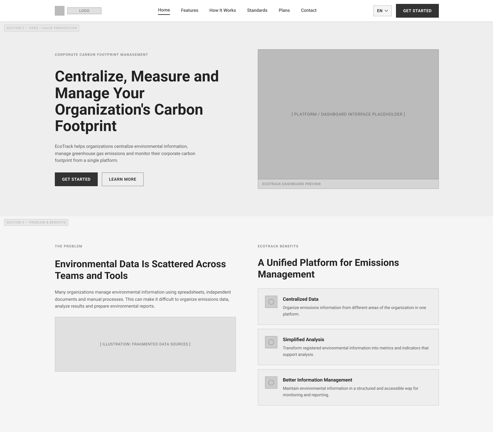

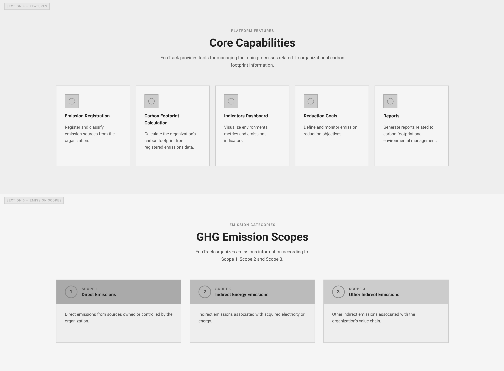

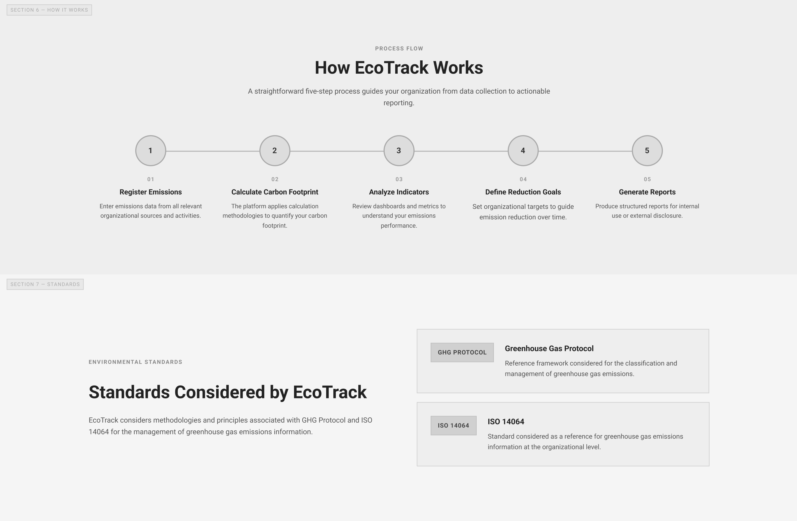

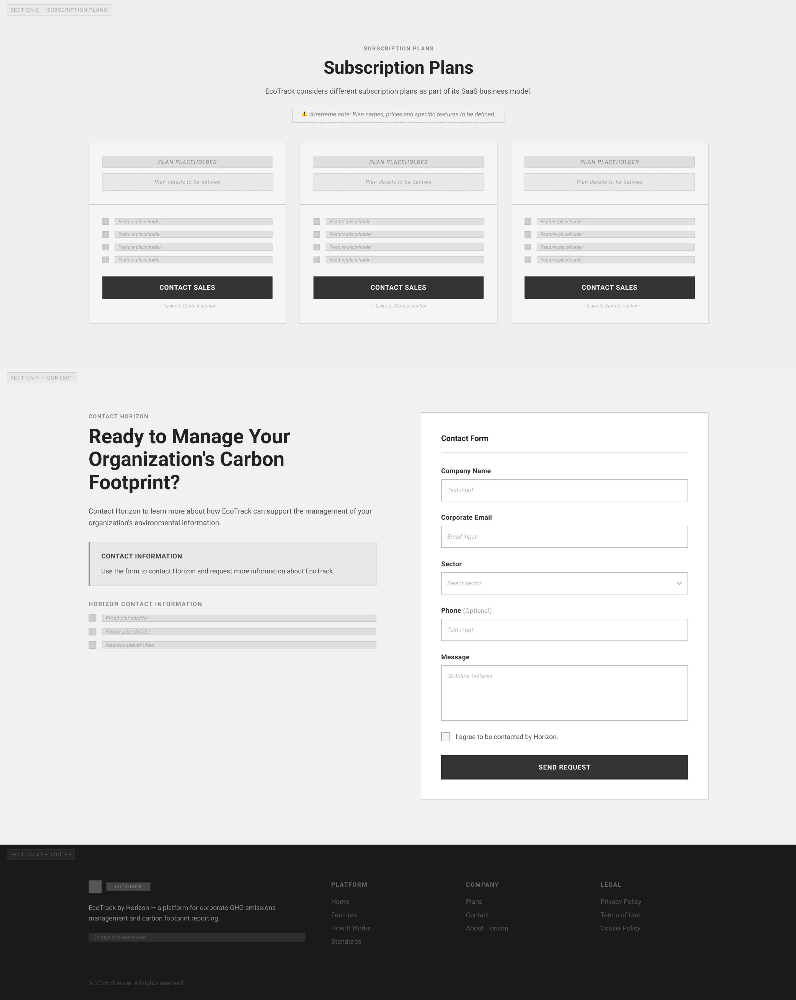

#### Mobile Web Browser

La versión Mobile mantiene la misma Information Architecture de la versión Desktop, pero reorganiza los componentes en una estructura principalmente vertical para adaptarse al espacio disponible.

El Navbar utiliza una navegación compacta mediante un menú desplegable y mantiene disponible el selector de idioma.

El Hero organiza primero la propuesta de valor y las Call To Action, seguido por la representación visual de la plataforma.

Las Cards correspondientes a Benefits, Features, Emission Scopes, Standards y Subscription Plans se presentan de manera apilada.

How It Works transforma la secuencia horizontal utilizada en Desktop en un flujo vertical, facilitando la lectura de los pasos en dispositivos Mobile.

La sección Contact presenta primero la información introductoria y posteriormente el formulario, cuyos campos ocupan el espacio disponible para facilitar la interacción mediante dispositivos táctiles.

El Footer reorganiza sus diferentes grupos de enlaces en bloques verticales, manteniendo la misma información disponible en la versión Desktop.

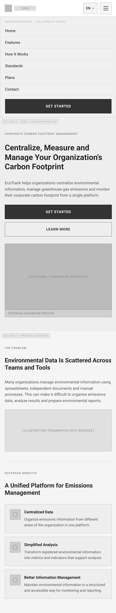

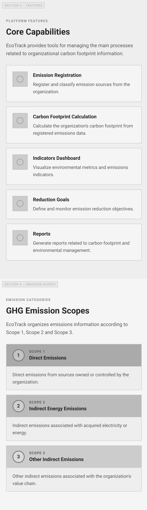

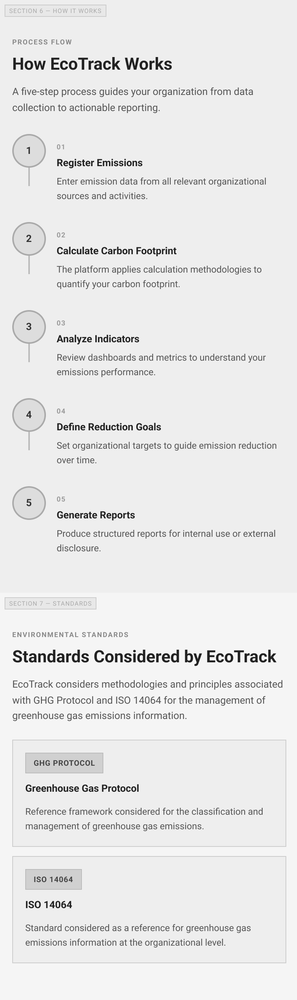

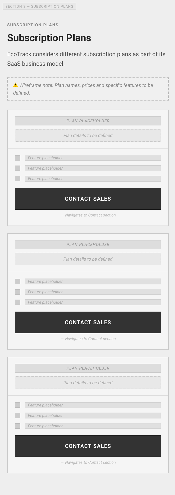

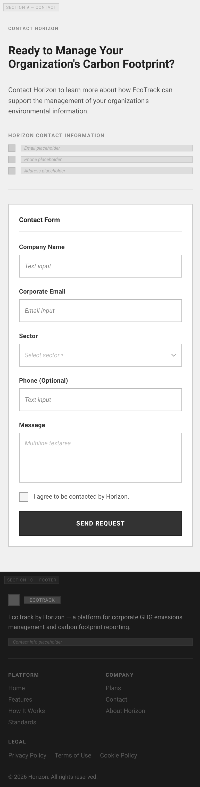

Las decisiones planteadas en ambas versiones buscan mantener una jerarquía visual clara, navegación predecible, consistencia entre componentes y adaptación responsive. Asimismo, se consideran elementos orientados a inclusive design como una estructura de encabezados reconocible, labels visibles en los formularios, áreas de interacción apropiadas para dispositivos táctiles y una navegación que no depende exclusivamente del color.

### 4.3.2. Landing Page Mock-up

El Landing Page Mock-up de EcoTrack representa la propuesta visual de alta fidelidad desarrollada a partir de los Wireframes definidos previamente. La propuesta aplica los lineamientos establecidos en las General Style Guidelines y Web Style Guidelines, manteniendo consistencia entre la identidad visual, los componentes de interfaz y la Information Architecture del producto.

El Mock-up fue elaborado en Figma y considera versiones para Desktop Web Browser y Mobile Web Browser. Ambas versiones mantienen la misma estructura de información y funcionalidades, adaptando la distribución de los componentes de acuerdo con el espacio disponible.

La identidad visual de EcoTrack utiliza principalmente tonalidades verdes y teal asociadas con sostenibilidad, tecnología y análisis de información ambiental. Asimismo, se utilizan colores neutros para fondos, superficies y contenido textual, permitiendo mantener una jerarquía visual clara.

Roboto se utiliza como tipografía principal debido a su legibilidad en interfaces digitales. La jerarquía tipográfica diferencia títulos, subtítulos, contenido principal y textos complementarios mediante variaciones de tamaño y peso.

Los componentes visuales, como Buttons, Cards, Form Fields y elementos de navegación, mantienen criterios consistentes de espaciado, bordes, estados y jerarquía visual de acuerdo con el Design System planteado para EcoTrack.

El Navbar incorpora la identidad de EcoTrack, las principales opciones de navegación, una Call To Action y un selector de idioma. English se presenta como idioma predeterminado, mientras que Latin American Spanish se considera como segunda alternativa dentro de la experiencia.

La sección Hero utiliza una composición destacada que presenta la propuesta de valor de EcoTrack junto con una representación visual de la futura interfaz de la plataforma. Esta representación incluye indicadores relacionados con emisiones, Scope 1, Scope 2, Scope 3, tendencias y objetivos de reducción.

Problem & Benefits utiliza elementos visuales y Cards para representar el problema relacionado con la dispersión de información ambiental y los beneficios principales asociados con la centralización y análisis de dicha información.

La sección Features presenta las funcionalidades principales mediante Cards visualmente consistentes. Estas incluyen Emission Registration, Carbon Footprint Calculation, Indicators Dashboard, Reduction Goals y Reports.

Emission Scopes utiliza una composición diferenciada para Scope 1, Scope 2 y Scope 3, permitiendo identificar visualmente cada categoría de emisiones considerada por EcoTrack.

How It Works representa el flujo principal de uso mediante cinco pasos:

`Register Emissions → Calculate Carbon Footprint → Analyze Indicators → Define Reduction Goals → Generate Reports`

La sección Standards presenta GHG Protocol e ISO 14064 como referencias consideradas dentro del dominio de EcoTrack. La propuesta visual evita representar estas referencias como certificaciones o acreditaciones de la plataforma.

Subscription Plans presenta la estructura prevista para las futuras alternativas de suscripción de EcoTrack. Debido a que los nombres, precios y características específicas de los planes todavía no han sido definidos, se utilizan contenidos visuales genéricos que permiten representar la estructura sin establecer condiciones comerciales definitivas.

La sección Contact utiliza un formulario orientado a organizaciones interesadas en obtener información adicional sobre EcoTrack. Los Form Fields mantienen labels visibles y una jerarquía clara para Company Name, Corporate Email, Sector, Phone y Message, además de una opción de consentimiento y la Call To Action `Send Request`.

Finalmente, el Footer utiliza una superficie oscura que contrasta con el contenido principal y agrupa la identidad de EcoTrack, enlaces de navegación, información corporativa y espacios destinados a información legal.

#### Desktop Web Browser

La versión Desktop aprovecha el espacio horizontal para presentar composiciones de múltiples columnas, Cards distribuidas horizontalmente y una mayor separación entre contenido textual y elementos visuales.

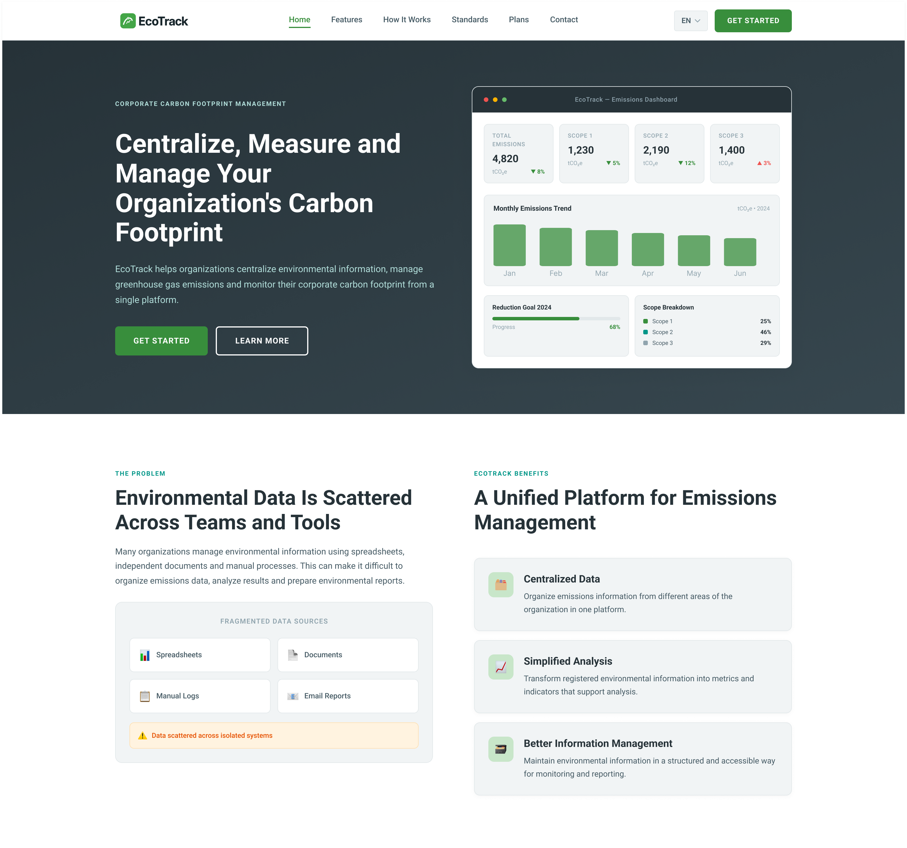

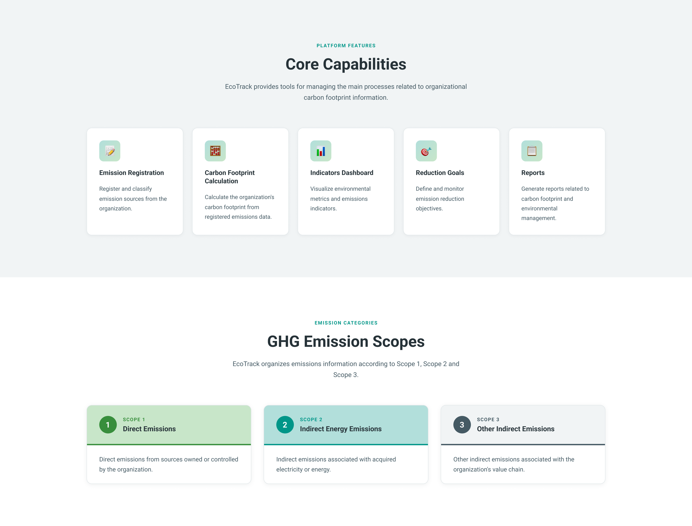

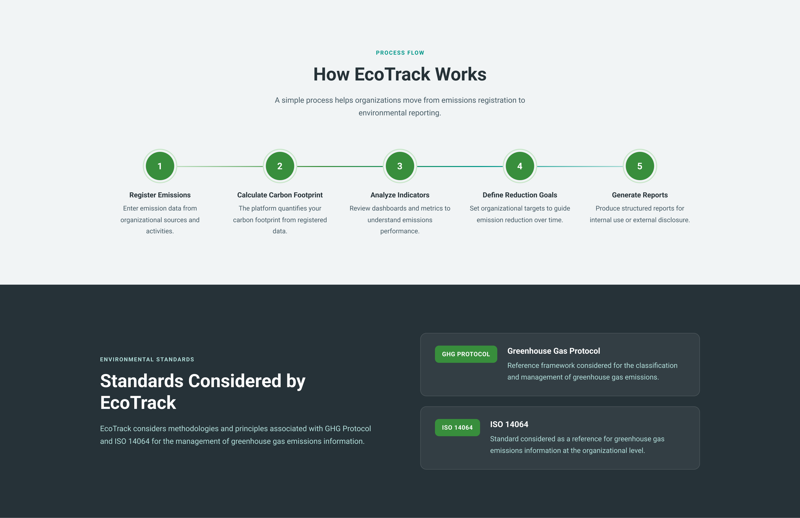

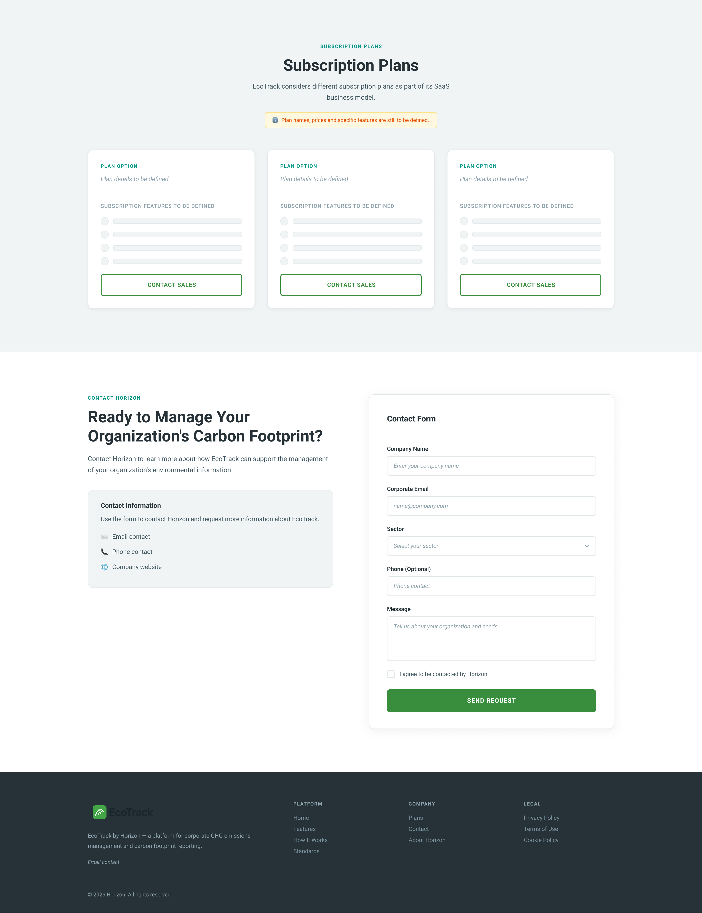

#### Mobile Web Browser

La versión Mobile conserva la misma identidad visual y arquitectura de información de la versión Desktop, reorganizando los componentes en una estructura vertical.

El Navbar utiliza una configuración compacta, mientras que Cards, funcionalidades, Emission Scopes, Standards y Subscription Plans se presentan de forma apilada.

How It Works adapta el recorrido horizontal de Desktop a una secuencia vertical, facilitando la lectura de los pasos en pantallas pequeñas.

Los Buttons y Form Fields se adaptan al espacio disponible, manteniendo dimensiones apropiadas para interacción táctil y separación suficiente entre elementos interactivos.

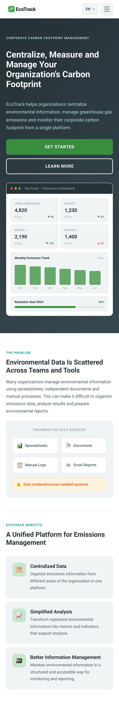

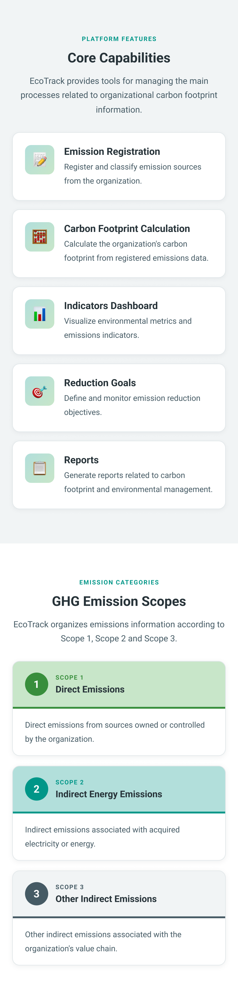

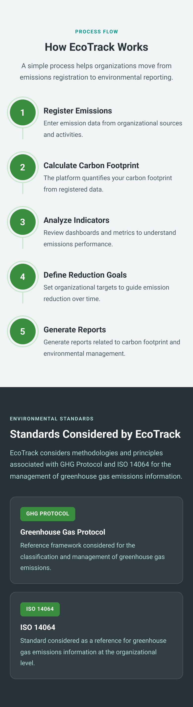

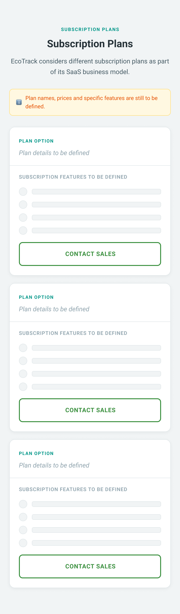

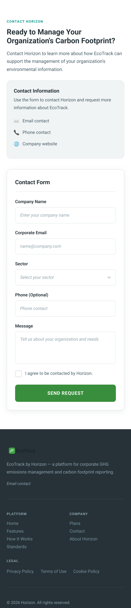

La propuesta busca mantener una experiencia consistente entre Desktop y Mobile, aplicando la identidad visual de EcoTrack, una jerarquía clara, componentes reutilizables y una distribución responsive que facilite la comprensión y navegación del Landing Page.

## 4.4. Web Applications UX/UI Design

### 4.4.1. Web Applications Wireframes

<!-- Completar -->

### 4.4.2. Web Applications Wireflow Diagrams

<!-- Completar -->

### 4.4.3. Web Applications Mock-ups

<!-- Completar -->

### 4.4.4. Web Applications User Flow Diagrams

<!-- Completar -->

---

## 4.5. Web Applications Prototyping

<!-- Completar -->

---

## 4.6. Domain-Driven Software Architecture

### 4.6.1. Design-Level Event Storming

<!-- Completar -->

### 4.6.2. Software Architecture Context Diagram

<!-- Completar -->

### 4.6.3. Software Architecture Container Diagrams

<!-- Completar -->

### 4.6.4. Software Architecture Components Diagrams

<!-- Completar -->

---

## 4.7. Software Object-Oriented Design

### 4.7.1. Class Diagrams

<!-- Completar -->

---

## 4.8. Database Design

### 4.8.1. Database Diagrams

<!-- Completar -->

---

# Capítulo V: Product Implementation, Validation & Deployment

## 5.1. Software Configuration Management

### 5.1.1. Software Development Environment Configuration

<!-- Completar -->

### 5.1.2. Source Code Management

<!--
Incluir URLs de:
- Project Report
- Landing Page
- Frontend Web Application
- Web Services

Explicar:
- GitFlow
- main
- develop
- feature/*
- release/*
- hotfix/*
- Conventional Commits
- Semantic Versioning
-->

### 5.1.3. Source Code Style Guide & Conventions

<!-- Completar -->

### 5.1.4. Software Deployment Configuration

<!-- Completar -->

---

## 5.2. Landing Page, Services & Applications Implementation

# 5.2.1. Sprint 1

## 5.2.1.1. Sprint Planning 1

<!-- Completar -->

## 5.2.1.2. Aspect Leaders and Collaborators

<!-- Completar -->

## 5.2.1.3. Sprint Backlog 1

<!-- Completar -->

## 5.2.1.4. Development Evidence for Sprint Review

<!-- Completar -->

## 5.2.1.5. Execution Evidence for Sprint Review

<!-- Completar -->

## 5.2.1.6. Services Documentation Evidence for Sprint Review

<!-- Completar -->

## 5.2.1.7. Software Deployment Evidence for Sprint Review

<!-- Completar -->

## 5.2.1.8. Team Collaboration Insights during Sprint

<!-- Completar -->

---

# 5.2.2. Sprint 2

## 5.2.2.1. Sprint Planning 2

<!-- Completar -->

## 5.2.2.2. Aspect Leaders and Collaborators

<!-- Completar -->

## 5.2.2.3. Sprint Backlog 2

<!-- Completar -->

## 5.2.2.4. Development Evidence for Sprint Review

<!-- Completar -->

## 5.2.2.5. Execution Evidence for Sprint Review

<!-- Completar -->

## 5.2.2.6. Services Documentation Evidence for Sprint Review

<!-- Completar -->

## 5.2.2.7. Software Deployment Evidence for Sprint Review

<!-- Completar -->

## 5.2.2.8. Team Collaboration Insights during Sprint

<!-- Completar -->

---

# 5.2.3. Sprint 3

## 5.2.3.1. Sprint Planning 3

<!-- Completar -->

## 5.2.3.2. Aspect Leaders and Collaborators

<!-- Completar -->

## 5.2.3.3. Sprint Backlog 3

<!-- Completar -->

## 5.2.3.4. Development Evidence for Sprint Review

<!-- Completar -->

## 5.2.3.5. Execution Evidence for Sprint Review

<!-- Completar -->

## 5.2.3.6. Services Documentation Evidence for Sprint Review

<!-- Completar -->

## 5.2.3.7. Software Deployment Evidence for Sprint Review

<!-- Completar -->

## 5.2.3.8. Team Collaboration Insights during Sprint

<!-- Completar -->

---

# 5.2.4. Sprint 4

## 5.2.4.1. Sprint Planning 4

<!-- Completar -->

## 5.2.4.2. Aspect Leaders and Collaborators

<!-- Completar -->

## 5.2.4.3. Sprint Backlog 4

<!-- Completar -->

## 5.2.4.4. Development Evidence for Sprint Review

<!-- Completar -->

## 5.2.4.5. Execution Evidence for Sprint Review

<!-- Completar -->

## 5.2.4.6. Services Documentation Evidence for Sprint Review

<!-- Completar -->

## 5.2.4.7. Software Deployment Evidence for Sprint Review

<!-- Completar -->

## 5.2.4.8. Team Collaboration Insights during Sprint

<!-- Completar -->

---

## 5.3. Validation Interviews

### 5.3.1. Diseño de Entrevistas

<!-- Completar -->

### 5.3.2. Registro de Entrevistas

<!-- Completar -->

### 5.3.3. Evaluaciones según heurísticas

<!-- Completar -->

---

## 5.4. Video About-the-Product

<!-- Completar -->

---

# Conclusiones

## Conclusiones y recomendaciones

<!-- Completar -->

---

# Video About-the-Team

<!-- Completar -->

---

# Bibliografía

Greenhouse Gas Protocol. (s. f.). *Corporate Standard*. World Resources Institute & World Business Council for Sustainable Development. https://ghgprotocol.org/corporate-standard

Greenhouse Gas Protocol. (s. f.). *Standards & Guidance*. World Resources Institute & World Business Council for Sustainable Development. https://ghgprotocol.org/standards-guidance

International Organization for Standardization. (2018). *ISO 14064-1:2018 Greenhouse gases — Part 1: Specification with guidance at the organization level for quantification and reporting of greenhouse gas emissions and removals*. ISO. https://www.iso.org/standard/66453.html

IBM. (2023). *What is carbon accounting?* IBM. https://www.ibm.com/think/topics/carbon-accounting

---

# Anexos

<!-- Completar -->